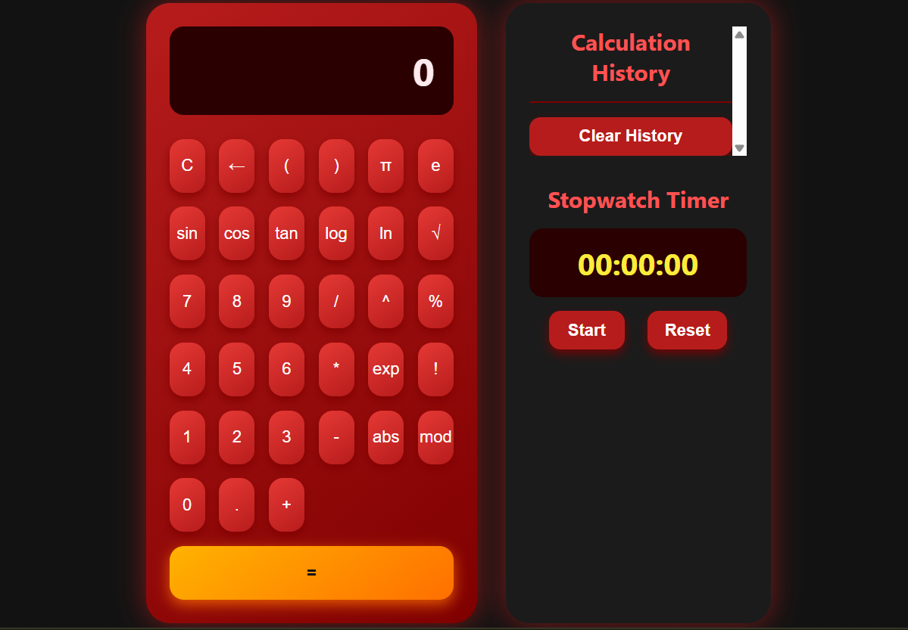

# 🧮 Advanced Scientific Calculator

A beautiful and fully functional scientific calculator built with HTML, CSS, and JavaScript.  
It includes a scientific expression evaluator, a calculation history panel, and a stopwatch timer — all inside a responsive and visually modern UI.

---

## ✨ Features

- ✅ Scientific functions: sin, cos, tan, log, ln, √, ^, !, π, e, mod, abs, exp, and more
- ✅ Calculation history (up to 20 operations)
- ✅ Stopwatch timer with start/stop and reset
- ✅ Red/black modern theme with yellow hover effects
- ✅ Responsive layout for mobile and desktop
- ✅ Built without any external libraries — pure HTML/CSS/JavaScript

---

## 📸 Screenshots



---

## Live Demo 

[Click here ☺️](https://yaldakhoshpey.github.io/Calculator_pro/)

## 📁 Project Structure

``` text
advanced-calculator/
├── index.html           # Main HTML structure
├── style.css            # Calculator & layout styling
├── app.js               # Calculator logic & interactions
├── screenshot.png       # UI screenshot for README preview
├── README.md            # Project documentation
└── assets/              # (Optional) icons, images, fonts etc.
```
---

## 📄 License

This project is licensed under the [MIT License](./LICENSE).

---

**made by *Yalda Khoshpey***
