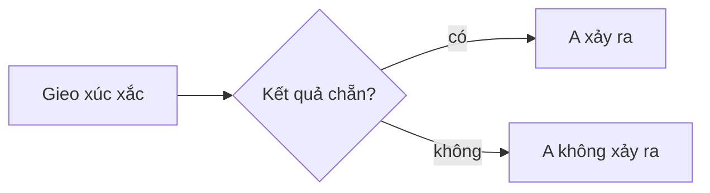

# Tạo khoá học mới: định dạng bundle JSON và cách sinh

> **Đọc hết file này là đủ** để một phiên làm việc khác (AI hay người) tạo một khoá học mới cho hệ
> thống khoá học của repo: hiểu cú pháp bundle, viết nội dung đúng định dạng, tự kiểm tra, rồi giao
> cho người dùng nạp. Mọi quy tắc lấy từ code (nguồn ở mục 12) và đã chạy thử đầu-cuối ngày
> 2026-10-02: markdown → bundle → bộ kiểm → FastAPI + SQLite → mở bằng Chromium.
>
> Hệ thống khoá học đến từ hai commit "feat(courses): … migrate content to database" và "Add QA
> report for course management…" — có trên `lab/dot-7-va-kiem-trinh-duyet` (`0546d37`) và bản rebase
> `lab/261003` (`b3a1d31`, cùng nội dung); lúc viết **chưa vào `main`**. Không thấy
> `backend/fastapi/tools/manage_courses.py` là đang ở nhánh chưa có hệ thống này.

## 0. Năm bước

1. **Thiết kế cây** section → nhóm → bài (mục 4: trang hiển thị cây thế nào).
2. **Viết mỗi bài một tệp `.md`** trong `backend/course-content/<slug>/noi-dung/` (mục 5).
3. **Ghép bundle** bằng `build.py` (mục 7) → `backend/course-content/<slug>.json`.
   Khoá vài bài ngắn thì viết thẳng JSON cũng được (mục 6).
4. **Kiểm** bằng `kiem_bundle.py` (mục 8.1) tới khi `ĐẠT` và không còn `CẢNH BÁO`.
5. **Xem thử** trên SQLite (mục 8.2). Nạp vào database thật là việc của người dùng (mục 8.3).

## 1. Hệ thống trong một phút

- Nội dung khoá học nằm trong **database** của `backend/fastapi`, phục vụ qua API
  `/api/v1/courses/<slug>/…`. Trang đọc tải manifest (mục lục, không markdown) rồi tải từng bài khi mở.
- **Một khoá = một bundle JSON** (định dạng nhập / xuất). Bản lưu dạng tệp: `backend/course-content/<slug>.json`.
- **Nạp bundle = tạo khoá, hoặc THAY TOÀN BỘ khoá cùng slug** (bài, cây, tệp). Slug đang có:
  `ai-everything`, `heuristic`, `heuristic-2`, `system-design`, `opic` (DB thật còn `test-course`) — chọn slug khác.
- Đọc: `/webapp/courses/khoa-hoc/?khoa=<slug>` — trang đọc chung cho mọi khoá, không cần dựng thư mục web.
- Quản lý: trang `/webapp/courses/quan-ly-khoa-hoc/` (soạn bài có xem trước, cây kéo-thả, tệp, lịch sử,
  thùng rác, kiểm tra liên kết), CLI `backend/fastapi/tools/manage_courses.py`, API `/courses/*`
  (bảng ở `backend/fastapi/README.md`). Toàn cảnh: `docs/khoa-hoc-database-ban-giao.md`.

## 2. Cấu trúc bundle

```jsonc
{
  "course": { … },                      // thông tin khoá — 2.1
  "nav":    [ { section }, … ],         // cây: section → groups → items (id bài) — 2.2, 2.3
  "docs":   { "<id bài>": { bài }, … }, // BẮT BUỘC, ít nhất 1 bài — 2.4, 2.5
  "assets": { "<tên tệp>": { "data": "<base64>" } },   // tuỳ chọn — 2.6
  "stats":  { }                         // tuỳ chọn — 2.7
}
```

Bản `export` còn có `slugs`, `order`, và trong mỗi bài `section`, `group`, `outline`, `words`,
`codeLines`, `minutes`, `updatedAt`: **khi nạp đều bị bỏ qua và tính lại** — không cần viết.

### 2.1 `course`

| Trường | Mặc định | Quy tắc / tác dụng |
| --- | --- | --- |
| `slug` | — (bắt buộc, trừ khi nạp kèm `--slug`) | `^[a-z0-9][a-z0-9-]{0,62}$`, khác `admin` `import` `export` `search` `trash`. Là địa chỉ: `?khoa=<slug>` |
| `title` | = slug | ≤ 255. Tiêu đề lớn ở trang chủ khoá, header, thẻ trong thư viện |
| `subtitle` | `""` | ≤ 255. Dòng nhỏ ở header; thẻ thư viện hiện subtitle (không có thì description) |
| `description` | `""` | đoạn dưới tiêu đề lớn ở trang chủ khoá (không có thì subtitle) |
| `icon` | `""` (thẻ hiện 📘) | một emoji, ≤ 32 ký tự |
| `published` | **`true`** | `false` = nháp: công chúng nhận 404, chỉ quản trị viên xem. **Khoá mới đặt `false`**, xem xong mới xuất bản |
| `config` | `{}` | object tự do, nạp là **thay cả object**. Khoá mới để `{}`: `webapp` chỉ dành cho khoá có trang dựng tay trong `webapp/`; `slugAliases`, `idAliases` do server tự ghi (bản export có sẵn thì giữ nguyên); `tags` được lưu nhưng không trang nào dùng |

### 2.2 Section (`nav[]`)

| Trường | Quy tắc |
| --- | --- |
| `id` | **bắt buộc**. `^[A-Za-z0-9][A-Za-z0-9_-]*$` (không dấu), ≤ 64, không trùng. Vd `khoa-hoc`, `bai-tap`, `tai-lieu` |
| `title` | **bắt buộc**, ≤ 255 |
| `sub` | mô tả ngắn dưới tiêu đề section (mục lục trái, thẻ trang chủ) |
| `icon` | một trong **`compass` `book` `layers` `route` `star` `note` `clock` `link`**. Tên khác (kể cả `grid`) hiện ô trống |
| `groups` | mảng nhóm |

### 2.3 Nhóm (`groups[]`)

| Trường | Quy tắc |
| --- | --- |
| `title` | **bắt buộc**, ≤ 255. Tên nhóm ở mục lục và trên thẻ trang chủ |
| `short` | ≤ 64. Tên ngắn: breadcrumb của bài, nhãn nhóm trong kết quả tìm kiếm (không có thì dùng `title`). Vd `Phần 1` cho `Phần 1 — Nền tảng` |
| `items` | mảng **id bài** theo thứ tự đọc; mọi id phải có trong `docs`. Mỗi bài ở **đúng một** nhóm (ở nhiều nhóm thì chỉ chỗ đầu tiên được giữ) |
| `meta` | object; trang đọc chung không dùng |

### 2.4 Bài (`docs`)

Khoá của object **chính là** id bài.

| Trường | Mặc định | Quy tắc / tác dụng |
| --- | --- | --- |
| `md` | `""` | markdown của bài (mục 5), ≤ 1 MB UTF-8 |
| `id` | = khoá | viết thì phải **trùng khoá**. `^\w[\w.@+/-]*$` — chữ (có dấu được), số, `. _ @ + - /`; không dấu cách, không đoạn `..`, ≤ 255. **Quy ước: đường dẫn tệp** như `phan-1/bai-01-ten.md` — link giữa các bài tính theo nó (5.2). Tiến độ người học gắn với id |
| `slug` | suy ra từ id | địa chỉ bài `#/<slug>`. `^[A-Za-z0-9][A-Za-z0-9._/-]*$`, ≤ 255, **không trùng giữa các bài**. Suy ra: bỏ `.md`, bỏ dấu, ký tự lạ → `-`; `x/README.md` → `x`; `README.md` → `gioi-thieu`. Vd `phan-1/bai-01-bien-co.md` → `phan-1/bai-01-bien-co` |
| `title` | dòng `# …` đầu tiên của `md` (không có thì tên tệp) | ≤ 500. Ở mục lục, tìm kiếm, nút bài trước / tiếp. **Thường bỏ trống, để dòng `#` quyết định** |
| `kind` | `"lesson"` | `^[a-z0-9][a-z0-9-]*$`, ≤ 32. **Chỉ `lesson`** được đếm vào "N bài giảng" ở trang chủ và được cộng điểm khi tìm kiếm; loại khác là nhãn tự do. Quy ước: `intro` (giới thiệu, đề cương), `lesson`, `exercise`, `project`, `case`, `exam`, `ref` (tra cứu) |
| `tag` | `null` | ≤ 64. Nhãn nổi ở mục lục và đầu bài. Quy ước: `★ trọng tâm`, `★ bổ sung`, `mở rộng` |
| `meta` | `{}` | 2.5 |

### 2.5 `meta` của bài — khoá trang đọc hiển thị

| Khoá | Kiểu | Hiện ra |
| --- | --- | --- |
| `no` | số | số trước tên bài ở mục lục; chip "Bài {no}/{of}"; thẻ trang chủ ghi "Bài {no}" thay cho tên bài. Đánh số liên tục cho các bài `lesson` của cả khoá |
| `of` | số | mẫu số của chip (không có → số bài `lesson`) |
| `level` | số nguyên 0–5 | chip ★★☆☆☆ (độ khó) |
| `hours` | chuỗi | chip đồng hồ — thời lượng học dự kiến, vd `"45 phút"`, `"3 giờ"` |
| `truc` | chuỗi | chip "Trục {truc}" |

Khoá khác được lưu nguyên nhưng không hiện.

### 2.6 `assets` — tệp đính kèm

- Dạng `{"<tên>": {"data": "<base64>"}}` (có `mime` cũng được — server bỏ qua, tự xác định theo đuôi).
- Tên `^[a-z0-9][a-z0-9._-]{0,119}$`. Server tự làm sạch tên lạ (`Sơ đồ.PNG` → `so-do.png`) nhưng
  markdown phải dùng **tên sau khi làm sạch** — đặt tên sạch ngay từ đầu.
- Đuôi nhận: `png jpg jpeg gif webp svg avif pdf txt csv json zip mp3 mp4 py ipynb`; ≤ 3 MB mỗi tệp.
- Trong bài, ở thư mục nào cũng viết ``, `[Tải đề](assets/<tên>.pdf)` — **không** `../assets/`.
- Tệp của khoá nháp chỉ quản trị viên xem được.

### 2.7 `stats`

`files`, `words`, `minutes`, `lessons` luôn được tính lại; khoá tự đặt khác (vd `"lessonsPlanned": 30`)
được giữ nguyên. Thường bỏ trống.

## 3. Giới hạn

| | |
| --- | --- |
| Một bài | ≤ 1 MB markdown — dài hơn thì tách bài |
| Một tệp | ≤ 3 MB |
| Bundle nạp qua trang Quản lý khi backend chạy trên Vercel | ≤ 4,5 MB (thân request) — lớn hơn thì nạp bằng CLI |
| Cây | đúng 3 tầng: section → nhóm → bài; không lồng sâu hơn |

## 4. Trang đọc hiển thị cây thế nào

Trang `/webapp/courses/khoa-hoc/?khoa=<slug>`:

- **Trang chủ khoá**
  - Tiêu đề lớn = `course.title`; đoạn dưới = `description` (không có thì `subtitle`); nút **Bắt đầu
    học** mở bài đầu tiên của cây. Ba ô số: số bài `lesson`, giờ đọc, số từ.
  - **"Lộ trình"**: mỗi **nhóm của section đầu tiên** (`nav[0]`) là một thẻ — thẻ đầu mang biểu
    tượng la bàn, sau đó `01`, `02`… — liệt kê tối đa 6 bài ("Bài {meta.no}" hoặc tên bài cắt ở `:`/`—`).
  - **"Các phần khác"**: mỗi **section từ thứ hai trở đi** là một thẻ (icon, title, sub), bấm vào mở
    bài đầu của section.
- **Mục lục trái**: section (icon, title, sub; section đầu mở sẵn) → nhóm (title, tiến độ) → bài
  (`meta.no`, title, `tag`).
- **Trang bài**: breadcrumb `Trang chủ › {section.title} › {nhóm short}`; tiêu đề = dòng `# …` đầu
  bài; chip từ `meta` + "~N phút đọc" + `tag`; cột phải "Trong bài này" từ các `##`/`###` (khi có từ
  3 mục); cuối bài: đánh dấu đã học, sao, ghi chú, **Bài trước / Bài tiếp theo thứ tự cây**.
- Bài **không nằm trong nhóm nào** không hiện ở mục lục và trang chủ (chỉ còn qua tìm kiếm, link, và
  cuối chuỗi "Bài tiếp").
- Phút đọc = max(2, round(số từ / 170 + số dòng mã / 22)).

**Cây nên có:** section đầu = lộ trình chính, 3–8 nhóm (phần / giai đoạn / tuần), nhóm đầu "Bắt đầu"
chứa bài `intro`, mỗi nhóm 2–8 bài. Bài tập, đồ án, tài liệu tra cứu là các section sau (icon
`layers`, `book`…).

## 5. Markdown

Trang đọc và khung xem trước ở trang Quản lý dùng chung một bộ dựng
(`webapp/courses/engine/hien-thi.js`): marked (GFM), KaTeX, highlight.js, Mermaid 10.

### 5.1 Cú pháp

| Viết | Ra |
| --- | --- |
| `# Tiêu đề` — **đúng một, ở dòng đầu** | tiêu đề bài (và `title` nếu bỏ trống) |
| `## Mục`, `### Mục con` | mục có neo, vào mục lục phải. Neo = bỏ dấu, chữ thường, bỏ ký tự ngoài `a-z0-9`, dấu cách, `-`; dấu cách → `-`; ≤ 60: `## Xác suất cơ bản` → `#xac-suat-co-ban`; trùng → `-2`, `-3` |
| **đậm**, *nghiêng*, ~~gạch~~, danh sách, `- [ ] việc`, bảng GFM | như GitHub; bảng cuộn ngang trên điện thoại. **Một dấu xuống dòng không ngắt dòng** — cần dòng trống (hoặc `<br>`) |
| `$…$` · `$$…$$` | công thức KaTeX trong dòng · khối (khối được nhiều dòng). Không để dấu cách ngay sau `$` mở / trước `$` đóng. `$` trong `code` an toàn. **Đừng dùng `$` cho tiền** (`\$` không thoát được) — viết `USD`, `đ` |
| ` ```python ` … ` ``` ` | khối mã tô màu, nhãn ngôn ngữ, nút chép |
| ` ``` ` không ngôn ngữ | giữ nguyên từng ký tự (hình vẽ ASCII) |
| ` ```mermaid ` | sơ đồ (flowchart, sequenceDiagram, classDiagram…); lỗi cú pháp thì hiện mã |
| `> 📌 …` (hoặc `⭐` `💡` `★`) | hộp **ghi nhớ** |
| `> ⚠️ …` | hộp **cảnh báo** |
| `> ❌ …` / `> 🚫 …` | hộp **sai lầm hay gặp** |
| `> ✅ …` / `> ✔ …` | hộp **đúng / đã kiểm chứng** |
| `> 📖 …` / `> 🔗 …` | hộp **tham khảo** |
| `> …` | trích dẫn thường — biểu tượng phải là ký tự ĐẦU của trích dẫn |
| `<details><summary>Đáp án</summary>` … `</details>` | khối gập; để dòng trống quanh markdown bên trong |
| `<b>` `<br>` `<kbd>` `<sub>` `<sup>` `<mark>` `` | giữ nguyên |
| `<script>` `<iframe>` `<style>` `<form>` `<object>`, thuộc tính `on…=`, `javascript:` | **bị gỡ** |
| ` ```lab ` — dòng 1 `id-lab?tham=so&…`, các dòng sau là chú thích | lab của `lab-visual` chạy ngay trong bài (id + tham số như nút "Chép liên kết" của trang lab; dán cả địa chỉ đầy đủ cũng được). Danh sách id: `webapp/courses/lab-visual/danh-sach.json` |
| ` ```py-chay ` · ` ```js-chay ` | ô mã sửa được + nút **Chạy** (Python = Pyodide tải lần đầu ~10 MB; JS trong Worker, dừng sau 5 s) |
| ` ```py-bai-tap ` · ` ```js-bai-tap ` | bài tập tự chấm: phần TRƯỚC dòng `---kiem---` là mã người học sửa, phần SAU là kiểm tra ẩn — Python `assert …`, JS `kiem(dieuKien, "thông báo")`. Đạt khi kiểm tra không ném lỗi |

Ví dụ bài tập tự chấm:

````markdown
```py-bai-tap
def tong_chan(ds):
    # trả về tổng các số chẵn trong ds
    return 0
---kiem---
assert tong_chan([1, 2, 3, 4]) == 6, "tong_chan([1, 2, 3, 4]) phải là 6"
assert tong_chan([]) == 0
```
````

### 5.2 Liên kết

| Viết | Đi tới |
| --- | --- |
| `[Bài 2](bai-02.md)`, `[Bảng](../tai-lieu/cong-thuc.md#xac-suat-co-ban)` | bài khác theo **đường dẫn tương đối tính từ thư mục của id bài hiện tại** (như tệp trên đĩa), kèm `#neo` được. `thu-muc/` hay `thu-muc` = `thu-muc/README.md` |
| `[Bài tập](#/bai-tap/bai-tap-1)`, `[…](#/slug#neo)` | bài khác theo slug |
| `[…](#neo)` | mục trong cùng bài |
| `[…](https://…)` | trang ngoài, mở tab mới |
| ``, `[…](assets/ten.pdf)` | tệp của khoá (2.6) |

Link `.md`, `#/slug` hay `assets/…` không trỏ tới đâu là **link hỏng** — bộ kiểm (8.1) báo kèm số dòng.

### 5.3 Bài mẫu (đã chạy thử)

````markdown
# Bài 1 — Biến cố và không gian mẫu

> 📌 Xác suất của một biến cố luôn nằm giữa 0 và 1: $0 \le P(A) \le 1$.

## Không gian mẫu

Gieo một con xúc xắc: $\Omega = \{1, 2, 3, 4, 5, 6\}$. Khi mọi kết quả đồng khả năng:

$$
P(A) = \frac{|A|}{|\Omega|}
$$

## Thử bằng mã

```python
from fractions import Fraction

omega = range(1, 7)
chan = [x for x in omega if x % 2 == 0]
print(Fraction(len(chan), len(omega)))  # 1/2
```

## Sơ đồ



## Bảng tóm tắt

| Biến cố | Kết quả | Xác suất |
|---|---|---|
| Chẵn | 2, 4, 6 | 1/2 |
| Lớn hơn 4 | 5, 6 | 1/3 |

> ⚠️ "Hoặc" không phải phép cộng thẳng: $P(A \cup B) = P(A) + P(B) - P(A \cap B)$.


<details><summary>Tự kiểm tra: xác suất ra số nguyên tố?</summary>

Các số nguyên tố là 2, 3, 5 nên $P = \tfrac{3}{6} = \tfrac{1}{2}$.

</details>

Bài tiếp: [Xác suất có điều kiện](bai-02-xac-suat-co-dieu-kien.md) · công thức: [bảng tra cứu](../tai-lieu/cong-thuc.md#xac-suat-co-ban).
````

### 5.4 Gợi ý soạn — theo các khoá đang có

- Tiếng Việt có dấu; thuật ngữ gốc tiếng Anh để trong ngoặc ở lần đầu.
- Đầu bài: `# Bài N — Tên`, ngay sau là một hộp `> 📌` nói điều quan trọng nhất (hoặc một trích dẫn
  tóm tắt: phần, thời lượng, độ khó).
- Thân bài: `## Mục tiêu` (gạch đầu dòng, đo được) → `## Kiến thức cần có` (link bài trước) →
  `## 1. …`, `## 2. …` → ví dụ / lab → `## Cạm bẫy` (`> ❌`) → `## Tóm tắt` → `## Bài tập` (đáp án
  trong `<details>`).
- Bài giảng 800–2 500 từ (≈ 6–17 phút đọc), dài hơn thì tách; mỗi bài từ 3 mục `##` trở lên để có
  mục lục phải. Công thức bằng KaTeX, sơ đồ bằng Mermaid, ví dụ mã chạy được và có tên ngôn ngữ.

## 6. Ví dụ bundle tối thiểu — viết thẳng JSON

Trong chuỗi JSON: xuống dòng là `\n`, mỗi `\` của công thức phải gấp đôi (`\\frac`), `"` thành `\"`.
Tệp dưới nạp được ngay (đã chạy thử); slug tự suy ra thành `gioi-thieu`, `phan-1/bai-01`,
`tai-lieu/thuat-ngu`, tiêu đề lấy từ dòng `#`.

```json
{
  "course": {
    "slug": "vi-du-toi-thieu",
    "title": "Ví dụ tối thiểu",
    "subtitle": "Ba bài để thử định dạng",
    "description": "Khoá mẫu: một bài giới thiệu, một bài giảng có công thức, một trang tra cứu.",
    "icon": "🧪",
    "published": false,
    "config": {}
  },
  "nav": [
    {"id": "khoa-hoc", "title": "Lộ trình", "sub": "2 bài", "icon": "compass", "groups": [
      {"title": "Bắt đầu", "short": "Bắt đầu", "items": ["gioi-thieu/README.md"]},
      {"title": "Phần 1 — Phân số", "short": "Phần 1", "items": ["phan-1/bai-01.md"]}
    ]},
    {"id": "tai-lieu", "title": "Tài liệu tra cứu", "sub": "mở khi cần", "icon": "book", "groups": [
      {"title": "Tra cứu", "short": "Tra cứu", "items": ["tai-lieu/thuat-ngu.md"]}
    ]}
  ],
  "docs": {
    "gioi-thieu/README.md": {
      "kind": "intro",
      "md": "# Giới thiệu\n\n> 📖 Khoá này dành cho ai, học xong làm được gì.\n\nBắt đầu từ [Bài 1](../phan-1/bai-01.md).\n"
    },
    "phan-1/bai-01.md": {
      "tag": "★ trọng tâm",
      "meta": {"no": 1, "of": 1, "level": 1, "hours": "15 phút"},
      "md": "# Bài 1 — Cộng phân số\n\n## Định nghĩa\n\nPhân số $\\frac{a}{b}$ với $b \\ne 0$.\n\n## Quy tắc\n\n$$\n\\frac{a}{b} + \\frac{c}{d} = \\frac{ad + bc}{bd}\n$$\n\n> ⚠️ Không cộng tử với tử, mẫu với mẫu.\n\n## Đọc thêm\n\nXem [thuật ngữ](../tai-lieu/thuat-ngu.md#phan-so).\n"
    },
    "tai-lieu/thuat-ngu.md": {
      "kind": "ref",
      "md": "# Thuật ngữ\n\n## Phân số\n\nThương của hai số nguyên, viết $\\frac{a}{b}$.\n"
    }
  }
}
```

## 7. Ghép bundle từ thư mục markdown — cách nên dùng

Markdown dài trong chuỗi JSON rất dễ sai (thoát `\`, `"`, xuống dòng). Viết mỗi bài một tệp rồi ghép:

```text
backend/course-content/<slug>/
  build.py            ← mẫu dưới: sửa KHOA và CAY
  noi-dung/           ← mỗi bài một tệp .md; id bài = đường dẫn tương đối trong thư mục này
    gioi-thieu/README.md
    phan-1/bai-01-bien-co.md …
  assets/             ← tuỳ chọn: ảnh / tệp, tên sẵn chữ thường không dấu
→ ghi ra backend/course-content/<slug>.json
```

Mẫu dưới là một khoá 6 bài đã chạy thử (bài 1 chính là bài mẫu ở 5.3). Chạy:
`python backend/course-content/<slug>/build.py` (Python 3, chỉ thư viện chuẩn).

```python
#!/usr/bin/env python3
# -*- coding: utf-8 -*-
"""Sinh backend/course-content/<slug>.json từ markdown trong ./noi-dung/ và tệp trong ./assets/.

    python backend/course-content/<slug>/build.py
"""
import base64
import json
import os

HERE = os.path.dirname(os.path.abspath(__file__))
NOI_DUNG = os.path.join(HERE, "noi-dung")   # id bài = đường dẫn tương đối trong thư mục này
TEP = os.path.join(HERE, "assets")          # ảnh / tệp đính kèm (tuỳ chọn); tên sẵn chữ thường không dấu

KHOA = {
    "slug": "nhap-mon-xac-suat",
    "title": "Nhập môn xác suất",
    "subtitle": "Từ biến cố đến biến ngẫu nhiên",
    "description": "Ba bài ngắn có ví dụ chạy được, một bộ bài tập và bảng công thức tra cứu.",
    "icon": "🎲",
    "published": False,              # nháp: kiểm tra xong mới xuất bản
    "config": {},
}

# section → nhóm → bài. Mỗi bài: "id" hoặc ("id", {kind, tag, meta, slug, title}).
CAY = [
    {"id": "khoa-hoc", "title": "Lộ trình", "sub": "3 bài · khoảng 1 giờ", "icon": "compass", "groups": [
        {"title": "Bắt đầu", "short": "Bắt đầu", "items": [("gioi-thieu/README.md", {"kind": "intro"})]},
        {"title": "Phần 1 — Biến cố và xác suất", "short": "Phần 1", "items": [
            ("phan-1/bai-01-bien-co.md", {"meta": {"no": 1, "of": 3, "level": 1, "hours": "20 phút"}}),
            ("phan-1/bai-02-xac-suat-co-dieu-kien.md",
             {"meta": {"no": 2, "of": 3, "level": 2}, "tag": "★ trọng tâm"}),
        ]},
        {"title": "Phần 2 — Biến ngẫu nhiên", "short": "Phần 2", "items": [
            ("phan-2/bai-03-bien-ngau-nhien.md", {"meta": {"no": 3, "of": 3, "level": 2}}),
        ]},
    ]},
    {"id": "thuc-hanh", "title": "Bài tập", "sub": "làm sau mỗi phần", "icon": "layers", "groups": [
        {"title": "Bài tập", "short": "Bài tập", "items": [("bai-tap/bai-tap-1.md", {"kind": "exercise"})]},
    ]},
    {"id": "tai-lieu", "title": "Tài liệu tra cứu", "sub": "mở khi đang làm bài", "icon": "book", "groups": [
        {"title": "Tra cứu", "short": "Tra cứu", "items": [("tai-lieu/cong-thuc.md", {"kind": "ref"})]},
    ]},
]


def main():
    nav, docs = [], {}
    for sec in CAY:
        groups = []
        for grp in sec["groups"]:
            ids = []
            for item in grp["items"]:
                doc_id, extra = (item, {}) if isinstance(item, str) else item
                with open(os.path.join(NOI_DUNG, doc_id), encoding="utf-8") as f:
                    md = f.read().replace("\r\n", "\n")
                docs[doc_id] = dict({"id": doc_id, "md": md}, **extra)
                ids.append(doc_id)
            groups.append({"title": grp["title"], "short": grp.get("short", ""), "items": ids})
        nav.append({"id": sec["id"], "title": sec["title"], "sub": sec.get("sub", ""),
                    "icon": sec.get("icon", "book"), "groups": groups})
    bundle = {"course": KHOA, "nav": nav, "docs": docs}
    if os.path.isdir(TEP):
        bundle["assets"] = {}
        for ten in sorted(os.listdir(TEP)):
            with open(os.path.join(TEP, ten), "rb") as f:
                bundle["assets"][ten] = {"data": base64.b64encode(f.read()).decode("ascii")}
    ra = os.path.join(os.path.dirname(HERE), KHOA["slug"] + ".json")
    with open(ra, "w", encoding="utf-8", newline="\n") as f:
        json.dump(bundle, f, ensure_ascii=False, indent=1)
        f.write("\n")
    print("Đã ghi %s — %d bài, %d tệp" % (ra, len(docs), len(bundle.get("assets", {}))))


if __name__ == "__main__":
    main()
```

## 8. Kiểm tra, xem thử, nạp

### 8.1 Kiểm không cần database

Script dưới gọi thẳng code kiểm tra của server (`check_slug`, `_normalise_bundle`, `_bundle_assets`),
nên `ĐẠT` ở đây = server sẽ nhận. Lưu thành tệp tạm (vd trong scratchpad), chạy **từ gốc repo** bằng
venv của backend (Linux / macOS: `.venv/bin/python`):

```bash
backend/fastapi/.venv/Scripts/python.exe kiem_bundle.py backend/course-content/<slug>.json
```

```python
"""Kiểm một bundle khoá học KHÔNG cần database: đúng quy tắc import của server
(gọi thẳng code của server) + những thứ server không chặn nhưng làm trang xấu.

    backend/fastapi/.venv/Scripts/python.exe kiem_bundle.py backend/course-content/<slug>.json
"""
import json
import os
import sys

GOC = os.environ.get("GOC_REPO", ".")
sys.path.insert(0, os.path.join(GOC, "backend", "fastapi"))
from src.application.usecases.course_usecase import CourseUseCase  # noqa: E402
from src.domain.models.course_domain import CourseBundle  # noqa: E402
from src.domain.utils import course_links, course_text  # noqa: E402

#: biểu tượng section có trong trang đọc chung (webapp/courses/khoa-hoc/index.html)
ICON_CO = {"compass", "book", "layers", "route", "star", "note", "clock", "link"}

raw = json.load(open(sys.argv[1], encoding="utf-8"))
uc = CourseUseCase(repo=None)
try:
    uc.check_slug((raw.get("course") or {}).get("slug") or "")
    bundle = uc._normalise_bundle(CourseBundle.model_validate(raw))   # id, slug, kind, cỡ bài, cây…
    assets = uc._bundle_assets(bundle) or []                            # tên, loại, cỡ tệp
except Exception as e:  # noqa: BLE001
    sys.exit("LỖI (server sẽ từ chối): %s" % (getattr(e, "message", None) or e))

canh = []
rep = course_links.scan({d.id: d.md for d in bundle.docs.values()},
                        {d.slug: d.id for d in bundle.docs.values()}, {}, [a.name for a in assets])
for b in rep["broken"]:
    canh.append("link hỏng %s dòng %s: %s — %s" % (b["from"], b["line"], b["href"], b["reason"]))
xep = {}
for s in bundle.nav:
    if s.icon not in ICON_CO:
        canh.append("section %r: icon %r không có trong trang đọc chung" % (s.id, s.icon))
    for g in s.groups:
        if not g.items:
            canh.append("nhóm %r chưa có bài" % g.title)
        for i in g.items:
            if i in xep:
                canh.append("bài %r nằm ở 2 nhóm — chỉ nhóm đầu được giữ" % i)
            xep.setdefault(i, g.title)
for d in bundle.docs.values():
    if d.id not in xep:
        canh.append("bài %r không nằm trong nhóm nào — không hiện ở mục lục" % d.id)
    if not course_text._H1.search(d.md or ""):
        canh.append("bài %r thiếu dòng '# Tiêu đề' đầu bài" % d.id)
    lv = (d.meta or {}).get("level")
    if lv is not None and not (isinstance(lv, int) and 0 <= lv <= 5):
        canh.append("bài %r: meta.level phải là số nguyên 0–5" % d.id)
print("\n".join("CẢNH BÁO " + c for c in canh) or "Không có cảnh báo.")
print("ĐẠT: %d bài, %d section, %d tệp, %d link đã xét" % (len(bundle.docs), len(bundle.nav), len(assets), rep["checked"]))
```

`LỖI (server sẽ từ chối)` phải sửa. `CẢNH BÁO` (link hỏng, bài ngoài mục lục, thiếu `# Tiêu đề`, icon
lạ, nhóm rỗng, `level` sai) nên sửa.

### 8.2 Xem thử trên máy — SQLite, KHÔNG đụng database thật

> ⚠️ `backend/fastapi/.env` trỏ tới **database thật (Aiven)**. Mọi lệnh thử phải có `--db` (CLI)
> hoặc `DB_URL` (server) trỏ vào SQLite; không bao giờ thêm `--yes` khi chưa chắc đích là SQLite.

```bash
cd backend/fastapi
DB=sqlite+aiosqlite:///data/dev.sqlite3                  # data/ có sẵn, đã .gitignore
.venv/Scripts/python.exe tools/manage_courses.py --db $DB init-db
.venv/Scripts/python.exe tools/manage_courses.py --db $DB import ../course-content/<slug>.json
.venv/Scripts/python.exe tools/manage_courses.py --db $DB publish <slug> on   # xem không cần đăng nhập
.venv/Scripts/python.exe tools/manage_courses.py --db $DB search <slug> "tu khoa"
DB_URL=$DB COURSE_ADMIN_KEY=dev-key .venv/Scripts/python.exe -m uvicorn src.main:app --port 6789
```

- Đọc: `http://127.0.0.1:6789/webapp/courses/khoa-hoc/?khoa=<slug>`.
- Bản nháp / sửa: `http://127.0.0.1:6789/webapp/courses/quan-ly-khoa-hoc/`, đăng nhập bằng `dev-key`
  → chọn khoá → **Xem trước bản nháp ↗**, tab **Kiểm tra liên kết**, trình soạn có xem trước.
  Sửa ở đây thì `export` ngược về tệp:
  `.venv/Scripts/python.exe tools/manage_courses.py --db $DB export <slug> -o ../course-content/<slug>.json`
  (dùng `build.py` thì sửa tệp `.md` gốc — đừng để hai nguồn lệch nhau).
- Tự động / chụp ảnh: `webapp/courses/engine/kiem_khoa_hoc.py` có `MayChuThu([đường dẫn bundle])`
  dựng FastAPI thật trên SQLite tạm (cách dùng: `webapp/courses/khoa-hoc/check.py`).

### 8.3 Nạp vào database thật — người dùng làm

- **CLI**, từ máy vào được DB thật:
  `cd backend/fastapi && python tools/manage_courses.py import ../course-content/<slug>.json --yes`
  — thay toàn bộ khoá cùng slug, **không** giữ bản cũ.
- **Trang Quản lý** đã deploy: **Nạp bundle JSON** → chọn tệp. Trùng slug thì hỏi, bản cũ vào thùng
  rác 30 ngày. Tệp > 4,5 MB phải dùng CLI.
- **API**: `POST /api/v1/courses/import?slug=<slug>`, thân là bundle, header `X-Admin-Key`
  (hoặc `X-Admin-Session`).
- Xem bản nháp rồi bật **Đã xuất bản** ở tab Thông tin (hoặc `manage_courses.py publish <slug> on --yes`).

> AI không tự ghi vào database thật trừ khi người dùng bảo rõ: giao tệp `<slug>.json` và lệnh nạp.

### 8.4 Sửa một khoá đã có

`export` → sửa → nạp lại (thay toàn bộ). **Giữ nguyên id bài** — tiến độ, sao, ghi chú của người học
gắn với id: nạp bundle với id mới = bài mới, tiến độ cũ mất. Đổi id hay slug thì dùng **Đổi id…** /
ô Slug ở trang Quản lý: server ghi bí danh, tiến độ và link cũ đi theo.

## 9. Checklist trước khi giao

- [ ] `course.slug` hợp lệ và **chưa có khoá nào dùng** (nạp trùng = thay khoá đó); `published: false`.
- [ ] Mọi id trong `items` có trong `docs`; mọi bài nằm ở đúng một nhóm.
- [ ] Mỗi bài mở đầu bằng đúng một `# Tiêu đề`; bài `lesson` có `meta.no` liên tục.
- [ ] Section đầu là lộ trình; icon section thuộc 8 tên ở 2.2.
- [ ] `kiem_bundle.py`: `ĐẠT`, không `CẢNH BÁO`.
- [ ] Mở thử trên SQLite: trang chủ, một bài có công thức / sơ đồ / ảnh, một link giữa hai bài.

## 10. Lỗi thường gặp

| Server báo | Sửa |
| --- | --- |
| `Slug khoá học phải gồm 1–63 chữ thường không dấu…` | `course.slug`: chữ thường không dấu, số, `-` |
| `Id bài '…' không hợp lệ…` | bỏ dấu cách / ký tự lạ / đoạn `..` khỏi id |
| `Khoá '…' của bài không khớp id '…'` | khoá trong `docs` là id; bỏ trường `id` hoặc viết trùng |
| `Mục lục nhắc tới N bài không có trong khoá: […]` | id trong `items` gõ sai, hoặc quên thêm bài vào `docs` |
| `Hai bài '…' và '…' trùng slug '…'` | đặt `slug` riêng cho một bài |
| `Loại bài '…' không hợp lệ…` | `kind` chữ thường không dấu (`lesson`, không `Lesson`) |
| `Id section '…' không hợp lệ…` / `Trùng id section …` | id section không dấu, không trùng |
| `Section nào cũng cần id và tiêu đề` / `Field required` ở `nav.….title` | section cần `id` + `title`; nhóm cần `title` |
| `Bài '…' có N KB markdown, vượt giới hạn…` | tách bài |
| `Không nhận loại tệp này…` / `Tên tệp '…' không hợp lệ…` / `…không phải base64 hợp lệ` | xem 2.6 |
| Công thức thành chữ đỏ | lỗi cú pháp LaTeX, hoặc `$` dùng cho tiền |
| Ảnh không hiện | tên trong `assets` khác tên trong markdown, hoặc viết `../assets/…` |

## 11. Ngoại lệ: OPIc

`opic.json` dùng trang riêng `webapp/courses/opic-course/` với engine khác: bài `kind: script` /
`guide`, `meta` riêng (`en`, `dang`, `bo`, `phut`, `so`…), nhóm có `meta`, `config` có
`dang` / `bo` / `dangThuTu` / `boThuTu`. **Đừng bắt chước** cho khoá thường. Nguồn soạn:
`backend/course-content/opic/` (`build.py`).

## 12. Nguồn của các quy tắc — kiểm lại khi code đổi

| Quy tắc | Ở đâu |
| --- | --- |
| Kiểm tra khi nạp: regex, giới hạn, mặc định, suy slug / tiêu đề | `backend/fastapi/src/application/usecases/course_usecase.py`: `SLUG_RE`, `DOC_ID_RE`, `DOC_SLUG_RE`, `KIND_RE`, `SECTION_ID_RE`, `ICON_NAME_RE`, `_LIMITS`, `_derive_slug`, `_normalise_bundle`, `_validate_tree`, `import_bundle` |
| Mô hình bundle | `backend/fastapi/src/domain/models/course_domain.py` (`CourseBundle`) |
| Tệp đính kèm | `backend/fastapi/src/domain/utils/course_assets.py` |
| Link hỏng | `backend/fastapi/src/domain/utils/course_links.py` |
| Tiêu đề, mục lục bài, phút đọc | `backend/fastapi/src/domain/utils/course_text.py` |
| Dựng markdown | `backend/fastapi/webapp/courses/engine/hien-thi.js` |
| Trang chủ, mục lục, chip | `backend/fastapi/webapp/courses/engine/app.js` (`viewHome`, `buildNav`, `veDoc`); cấu hình trang chung `webapp/courses/khoa-hoc/assets/cau-hinh.js` |
| Biểu tượng section | `<symbol id="i-…">` trong `webapp/courses/khoa-hoc/index.html` |
| Mẫu khoá có sẵn (`co-ban`, `chu-de`) | `backend/fastapi/src/domain/utils/course_templates.py` |
