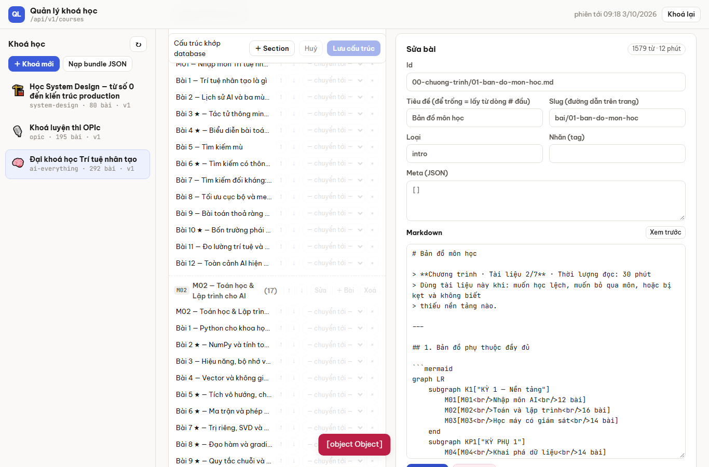
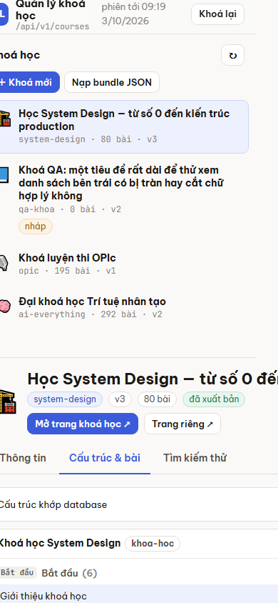
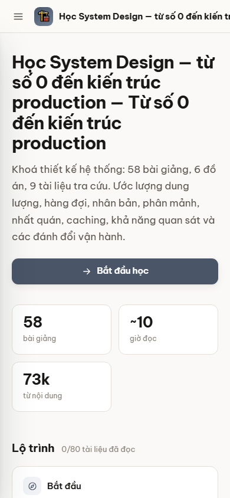
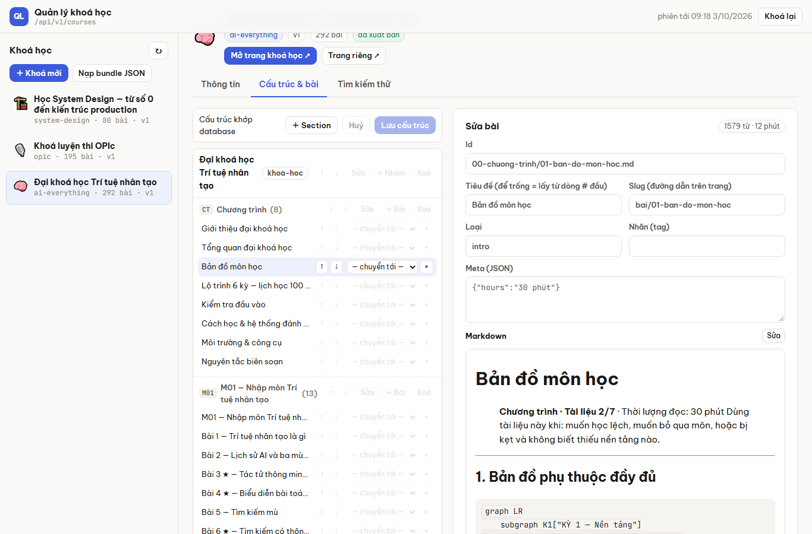
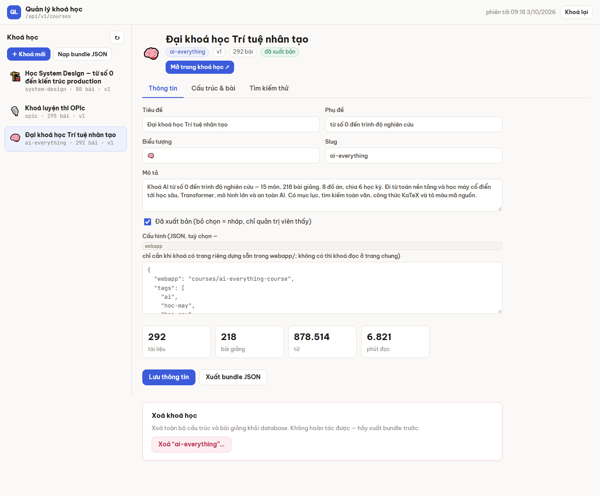
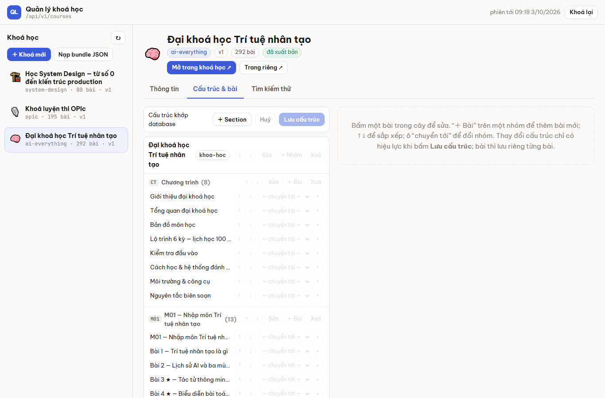

# Kiểm thử Quản lý khoá học — báo cáo QA

**Ngày:** 2026-10-02 · **Phạm vi:** trang `webapp/courses/quan-ly-khoa-hoc/`, Thư viện khoá học
`webapp/courses/khoa-hoc/`, API `/courses/*` · **Đã sửa cùng ngày** — trạng thái ở mục 0; mục 1–5
giữ nguyên như lúc báo cáo.

**Cách thử:** Playwright (Chromium) lái giao diện thật trên FastAPI thật + SQLite tạm, nạp 3 khoá
thật (AI 292 bài, OPIc 195 bài, System Design 80 bài). Desktop 1366×900, điện thoại 390×844,
sáng/tối, bàn phím, mất mạng và hết phiên giả lập, hai quản trị viên cùng lúc, thăm dò API.
**Không đụng database Aiven.** Ảnh bằng chứng: [`kiem-thu-quan-ly-khoa-hoc/`](kiem-thu-quan-ly-khoa-hoc/).

---

## 0. Trạng thái sau đợt sửa (2026-10-02, tối)

**20/20 lỗi đã sửa.** Đề xuất đã làm: P0 #1–#6, P1 #7–#15, P2 #21. **Chưa làm** P2 #16–#20 (tài
khoản và vai trò, xuất bản theo bài, số liệu người học, nhập / xuất Git–markdown, quiz): mỗi việc
cần quyết định sản phẩm trước — ai được làm gì, lưu gì về người học — chứ không phải sửa lỗi.

Mỗi lỗi có phép thử chống tái phát: **qlkh** = bước trong `quan-ly-khoa-hoc/check.py`, **kh** =
bước trong `khoa-hoc/check.py`, **pytest** = `tests/adapter/input/controller/test_course_editing.py`.

| ID | Sửa | Kiểm bằng |
| --- | --- | --- |
| QA-01 | lưu kèm `If-Match` (`rev` bài · `treeRev` cây · `infoRev` thông tin) → 409 + bản hiện tại; hỏi: tải bản server / ghi đè / xem lại; bài hiện khác biệt từng dòng | qlkh 5, 13 · pytest |
| QA-02 | một chốt "chưa lưu" (`QL.boQua`) cho ↻, đổi khoá, thùng rác, khoá mới, nhân bản, khoá phiên + `beforeunload` | qlkh 7 |
| QA-03 | chốt trên tính cả tab Thông tin | qlkh 3 |
| QA-04 | `QL.thongDiep` đọc mảng `detail` của 422; meta / loại / slug / cấu hình kiểm tra cạnh ô, sai thì không gửi | qlkh 4, 11 |
| QA-05 | ≤ 900 px: ngăn kéo danh sách khoá, cây và trình soạn là hai màn; màn cảm ứng nút 36–38 px, điều khiển luôn hiện | qlkh 23 |
| QA-06 | header trang đọc cắt tên dài; tiêu đề không ghép phụ đề khi tên đã chứa nó | kh 6 |
| QA-07 | id gợi ý = `<nhóm bỏ dấu>/<tiêu đề bỏ dấu>.md`, tự đánh số khi trùng | qlkh 9 |
| QA-08 | địa chỉ `#/<khoá>/<tab>/<id bài>`, `#/~thung-rac` | qlkh 2, 6, 12 |
| QA-09 | đổi slug giữ slug cũ làm bí danh (`manifest.aliases`, trang đọc chuyển hướng); "Đổi id…" (`POST /rename`, `idAliases` → tiến độ người học đi theo) | qlkh 15 · kh 5 · pytest |
| QA-10 | `/admin/verify`: 5 lần sai / địa chỉ / 5 phút, 50 lần toàn máy chủ → 429 `Retry-After` | pytest |
| QA-11 | hộp thoại section: id kiểm tra tại chỗ, sửa được id và biểu tượng | qlkh 8 |
| QA-12 | thông báo server tiếng Việt | pytest |
| QA-13 | danh sách khoá là nút bấm, `role=tabpanel`, nhãn cho mọi nút điều khiển | qlkh 2 |
| QA-14 | xem trước dùng chung `engine/hien-thi.js` với trang đọc | qlkh 10 |
| QA-15 | bài ≤ 1 MB (`COURSE_DOC_MAX_BYTES`), tệp ≤ 3 MB → 413 nói rõ | pytest |
| QA-16 | nhãn cấu hình không còn `<code>` | — (nhìn) |
| QA-17 | cây không còn `<select>` mỗi dòng (⇄ mở menu khi cần), chỉ vẽ lại cây, giữ cuộn và tiêu điểm | qlkh 7 |
| QA-18 | Ctrl+S toàn trang (bài › cây › thông tin) | qlkh 10 |
| QA-19 | tô sáng từ khoá, điểm chỉ còn ở tooltip, bấm mở bài + cuộn cây tới bài | qlkh 6 |
| QA-20 | hộp xoá liệt kê bài đang link tới; tab Kiểm tra liên kết | qlkh 17 |

Mục 3 cũng đã xử lý: hộp thoại thay `prompt()`; điều khiển luôn hiện trên màn cảm ứng; ô lọc,
thu gọn, kéo-thả; "＋ Bài" trên nhóm chưa lưu chỉ còn một nút "Lưu cấu trúc rồi thêm bài"; lỗi
nằm cạnh ô; "Loại" có danh sách gợi ý (meta và cấu hình vẫn là JSON, nhưng kiểm tra tại chỗ);
khoá mới có mẫu; có nút sáng / tối.

---

## 1. Tóm tắt

| Mức | Số lỗi | Ý nghĩa |
| --- | ---: | --- |
| Cao | 3 | mất dữ liệu người biên tập, không cảnh báo |
| Trung bình | 7 | sai chức năng hoặc dùng không được trên một môi trường |
| Thấp | 10 | khó chịu, sai lệch nhỏ, nợ hiệu năng |

Không có lỗi 5xx nào trong toàn bộ các lượt chạy; console chỉ có các 4xx do chính phép thử cố ý gây ra.

**Đã tốt, nên giữ:** hết phiên giữa lúc lưu thì nội dung đang sửa vẫn còn, đăng nhập lại lưu được;
mất mạng khi lưu báo rõ và giữ nội dung; đổi bài khi đang sửa có hỏi; `beforeunload` chặn đóng tab;
khung sửa bài dính (sticky) nên bấm bài ở cuối cây vẫn thấy; giao diện tối ổn; danh mục Thư viện
khoá học trên điện thoại gọn; thông báo kiểm tra của server cụ thể (slug, kind, id, section trùng).

---

## 2. Lỗi

| ID | Mức | Chỗ | Lỗi | Tái hiện |
| --- | --- | --- | --- | --- |
| QA-01 | **Cao** | sửa bài, sửa cấu trúc | Hai người (hoặc hai tab) cùng sửa: ai lưu sau **ghi đè im lặng** bản của người kia. | Tab A và B mở cùng một bài; A sửa, lưu; B (đang giữ bản cũ) sửa, lưu → "Đã lưu bài", bản của A mất. |
| QA-02 | **Cao** | nút ↻ danh sách khoá | Bỏ **thay đổi cấu trúc chưa lưu** mà không hỏi. | Tab Cấu trúc → bấm ↓ một bài (thanh "Có thay đổi chưa lưu") → ↻ → thay đổi biến mất. |
| QA-03 | **Cao** | tab Thông tin | Sửa dở rồi chọn khoá khác: **mất không hỏi** (chỉ cấu trúc và bài có cảnh báo). | Sửa Phụ đề, không lưu → bấm khoá khác → quay lại: phụ đề cũ. |
| QA-04 | TB | mọi form | Lỗi 422 hiện **"[object Object]"** — `detail` của FastAPI là mảng. | Meta (JSON) của bài = `[]` → Lưu bài.  |
| QA-05 | TB | điện thoại | Chọn một khoá: trang rộng **773 px** trên màn 390 px, nút ↑/↓ chỉ 22×24 px, khung sửa bài ở tận y ≈ 3900. Quản trị trên điện thoại gần như không dùng được. | 390×844 → đăng nhập → chọn khoá → Cấu trúc.  |
| QA-06 | TB | Thư viện khoá học `?khoa=` | Trên điện thoại tên khoá dài không cắt, đẩy header → bố cục rộng 682 px. Tiêu đề lớn **lặp phụ đề** khi tên khoá đã chứa phụ đề ("…production — Từ số 0 đến kiến trúc production"). | `/webapp/courses/khoa-hoc/?khoa=system-design` ở 390 px.  |
| QA-07 | TB | "＋ Bài" | Gợi ý id bài **hỏng tiếng Việt** (nhóm "Bắt đầu" → `b-t-u/bai-moi.md`) và **trùng** ở bài thứ hai → "Id đã có", người dùng phải tự nghĩ đường dẫn. | Tạo nhóm tên ngắn có dấu → "＋ Bài" hai lần. |
| QA-08 | TB | điều hướng | F5 **mất khoá và tab đang chọn**: URL không đổi khi chọn khoá (dù code có đọc `#slug` lúc khởi động). Không chia sẻ được link tới một khoá/bài trong trang quản lý. | Chọn khoá, tab Cấu trúc → F5 → về màn "Chọn một khoá học". |
| QA-09 | TB | slug bài | Đổi slug làm **link cũ chết** ("Không tìm thấy trang"): bookmark, link đã chia sẻ, link chéo giữa các bài. Id bài không đổi được (ô Id khoá cứng). | Đổi slug `bai/00-de-cuong` → mở `#/bai/00-de-cuong`. |
| QA-10 | TB | bảo mật | `POST /courses/admin/verify` **không giới hạn số lần thử**: 40 lần đoán khoá trong 0,4 s, không chậm lại, không khoá. Khoá ngắn sẽ bị dò ra. | Gọi API 40 lần với khoá sai. |
| QA-11 | Thấp | "＋ Section" | Id sai (vd `Phần 1`) vẫn vào cây; chỉ báo lỗi khi **Lưu cấu trúc**; sau đó không sửa được id (nút Sửa chỉ đổi tiêu đề + mô tả) → phải xoá, tạo lại. Icon section cũng không sửa được. | "＋ Section" → id `Phần 1` → Lưu cấu trúc. |
| QA-12 | Thấp | thông báo | Lỗi từ server **bằng tiếng Anh** trong giao diện tiếng Việt ("Course slug must be…", "A course needs a title"). | Tạo khoá slug `Khoá Mới`. |
| QA-13 | Thấp | trợ năng | Mục trong danh sách khoá là `<li>` không focus được → **không chọn khoá bằng bàn phím**. 292 ô "chuyển tới" không có nhãn; tab không có `tabpanel`. | Tab qua trang: nhảy qua danh sách khoá. |
| QA-14 | Thấp | "Xem trước" | Xem trước **khác trang thật**: không vẽ mermaid, KaTeX, tô màu code, callout. Người viết không biết bài sẽ hiện ra sao. | Bài "Bản đồ môn học" (khoá AI) → Xem trước.  |
| QA-15 | Thấp | API | Không giới hạn cỡ một bài: 5 MB markdown được nhận. Trên Vercel (thân request ≤ 4,5 MB) sẽ vỡ 413 không rõ lý do. | `PUT /docs/…` 5 MB. |
| QA-16 | Thấp | tab Thông tin | Nhãn "Cấu hình": `webapp` trong `<code>` hiện thành **thanh xám cả dòng**. | Mở tab Thông tin.  |
| QA-17 | Thấp | hiệu năng | Khoá 292 bài: mở tab Cấu trúc **0,86 s**, mỗi lần ↑/↓ vẽ lại cả cây **0,6 s** (≈ 920 nút + 292 `<select>` × 22 lựa chọn). Dòng vừa bấm lệch 32 px. | Khoá AI → Cấu trúc → ↓.  |
| QA-18 | Thấp | phím tắt | Ctrl+S trong ô markdown không lưu (trình duyệt mở hộp "Lưu trang"). | Sửa bài → Ctrl+S. |
| QA-19 | Thấp | "Tìm kiếm thử" | Không tô sáng từ khoá; hiện điểm thô (288, 246.8) vô nghĩa với người biên tập; bấm kết quả mở bài nhưng không cuộn cây tới bài đó. | Khoá AI → tìm "gradient". |
| QA-20 | Thấp | xoá bài | Hộp xác nhận không nói **bài nào đang link tới bài sắp xoá** → link chết sau khi xoá. | Xoá một bài được bài khác trỏ tới. |

---

## 3. Trải nghiệm — không sai nhưng làm chậm người dùng

- **Hộp `prompt()` của trình duyệt** cho section/nhóm: hai hộp liên tiếp, không kiểm tra, không xem trước, không sửa được sau.
- **Nút điều khiển mờ** đến khi rê chuột (↑ ↓ chuyển tới ×, Sửa/＋ Bài/Xoá): khó phát hiện, không dùng được trên màn cảm ứng.
- **Cột cây hẹp**: tên bài bị cắt ("Lộ trình 6 kỳ — lịch học 100 …"), tiêu đề section xuống 3 dòng.
- **Cây 292 bài không có ô lọc, không thu gọn nhóm, không kéo-thả**: chuyển một bài 50 vị trí = 50 lần bấm ↓ (mỗi lần 0,6 s).
- **"＋ Bài" bắt lưu cấu trúc trước** khi nhóm vừa tạo chưa lưu.
- **Meta và Cấu hình là JSON thô**; "Loại" là ô chữ tự do nhưng server chỉ nhận `a-z0-9-`.
- **Lỗi chỉ hiện bằng toast** 5 giây ở đáy, không nằm cạnh ô bị sai.
- **Khoá mới bắt đầu trắng trơn**: không có mẫu cấu trúc, không có "bước tiếp theo".
- Trang quản lý **không có nút sáng/tối** (theo hệ điều hành), khác trang đọc.

---

## 4. Đề xuất tính năng — theo thứ tự ưu tiên

### P0 — sửa trước khi giao cho người khác dùng

1. **Chống ghi đè**: gửi `If-Match: <revision>` khi lưu bài / cấu trúc / thông tin; server trả 409 nếu đã có người sửa, giao diện hiện "Có người vừa sửa — xem khác biệt / tải lại / ghi đè" (QA-01).
2. **Một chốt "chưa lưu" duy nhất** cho cả ba khu (thông tin, cấu trúc, bài) và mọi lối thoát: ↻, đổi khoá, đổi tab, khoá phiên (QA-02, QA-03).
3. **Hiển thị lỗi tử tế**: gom `detail` mảng của 422 thành câu đọc được, đặt lỗi cạnh ô; thông báo server tiếng Việt (QA-04, QA-12).
4. **URL theo trạng thái**: `#/<khoa>/<tab>/<id bài>` — F5 giữ chỗ, chia sẻ được link (QA-08).
5. **Giới hạn đăng nhập**: 5 lần sai / phút / IP rồi chờ tăng dần (QA-10); giới hạn cỡ bài ~1 MB kèm thông báo rõ (QA-15).
6. **Gợi ý id bài bỏ dấu + đánh số** (`bat-dau/bai-02.md`) (QA-07).

### P1 — trải nghiệm biên tập

7. **Trình sửa cây kiểu mới**: kéo-thả bài/nhóm/section, ô lọc, thu gọn nhóm, form tại chỗ thay `prompt()`, sửa id + icon section, chỉ vẽ lại phần đổi (QA-11, QA-17).
8. **Trình soạn bài chia đôi**: trái markdown, phải xem trước **bằng đúng engine trang đọc** (mermaid, KaTeX, code, callout); Ctrl+S; tự lưu nháp vào máy; thanh công cụ (đậm, link tới bài khác chọn từ danh sách, chèn công thức) (QA-14, QA-18).
9. **Tải ảnh / tệp đính kèm** vào khoá (hiện bài chỉ dùng được ảnh ở chỗ khác).
10. **Lịch sử phiên bản bài** + khôi phục; **thùng rác** cho bài và khoá đã xoá (giữ 30 ngày).
11. **Đổi slug giữ redirect**, đổi id bài giữ tiến độ người học (QA-09).
12. **Kiểm tra liên kết** trong khoá: báo link tới bài không tồn tại; cảnh báo khi xoá bài đang được trỏ tới (QA-20).
13. **Mẫu khoá mới** (Giới thiệu · Phần 1..n · Tài liệu tra cứu) và **nhân bản** khoá / bài.
14. **Trang quản lý dùng được trên điện thoại**: danh sách khoá thành ngăn kéo, cây và trình soạn thành hai màn, nút ≥ 40 px (QA-05); sửa header + tiêu đề lặp ở trang đọc (QA-06).
15. **Tìm kiếm thử** tô sáng từ khoá, bỏ điểm thô, cuộn tới bài trong cây (QA-19); lọc danh sách khoá khi > 20 khoá.

### P2 — vận hành và mở rộng

16. **Tài khoản quản trị riêng** thay một khoá chung: vai trò biên tập / duyệt / xuất bản, nhật ký "ai sửa gì lúc nào".
17. **Trạng thái và lịch xuất bản ở mức bài** (nháp → chờ duyệt → xuất bản, hẹn giờ) thay vì chỉ cả khoá.
18. **Số liệu người học**: lượt mở bài, tỉ lệ hoàn thành, từ khoá tìm mà không ra (tiến độ hiện chỉ nằm trong localStorage từng máy).
19. **Nhập / xuất thư mục markdown hoặc Git** (ZIP, đồng bộ ngược repo) cạnh bundle JSON.
20. **Bài tập / quiz trong bài** và tiến độ đồng bộ theo tài khoản người học.
21. **Trợ năng**: danh sách khoá chọn được bằng bàn phím, `role=tabpanel`, nhãn cho mọi ô (QA-13); nút sáng/tối.

---

## 5. Đề xuất thứ tự làm

| Đợt | Việc | Ước lượng |
| --- | --- | --- |
| 1 | P0 #1–#6 + QA-06, QA-13, QA-16 (lỗi nhỏ, sửa nhanh) | 1–2 ngày |
| 2 | #7 trình sửa cây + #8 trình soạn chia đôi (hai thay đổi lớn nhất về cảm nhận) | 3–5 ngày |
| 3 | #9–#13 (ảnh, lịch sử, redirect, kiểm tra link, mẫu) | 4–6 ngày |
| 4 | P2 theo nhu cầu thật (nhiều người biên tập? cần số liệu?) | — |

Mỗi lỗi đã có kịch bản tái hiện ở mục 2; khi sửa nên thêm đúng kịch bản đó vào
`quan-ly-khoa-hoc/check.py` (Playwright) hoặc `tests/…/test_course_controller.py` để không tái phát.
