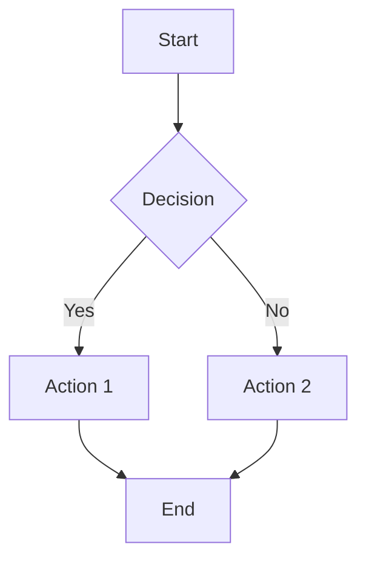

# 🚀 Getting Started with Markdown Editor

Welcome! This guide will help you get up and running in just a few minutes.

## ⚡ Quick Start (5 minutes)

### Step 1: Install Dependencies
```bash
npm install
```

### Step 2: Start Development Server
```bash
npm run dev
```

The browser will automatically open at `http://localhost:5173`

### Step 3: Login as Admin
1. Click the 🔐 button in the bottom-right corner
2. Enter the admin key: `markdown-editor-admin-2024`
3. Click "Login"

### Step 4: Start Using!
- **Left Panel**: Create files and folders
- **Middle Panel**: Write markdown
- **Right Panel**: See live preview

---

## 📝 Creating Your First Document

### Creating a File
1. Click ➕ button in the sidebar header
2. Type a filename (e.g., `my-document.md`)
3. Click "Create"
4. Start typing in the editor!

### Creating a Folder
1. Click ➕ button in the sidebar header
2. Type a folder name
3. Click the "Folder ✓" button to toggle to folder mode
4. Click "Create"
5. Drag files into the folder by clicking them

---

## 🎨 Writing Markdown

### Headers
```markdown
# Heading 1
## Heading 2
### Heading 3
#### Heading 4
##### Heading 5
###### Heading 6
```

### Text Formatting
```markdown
**Bold text**
*Italic text*
***Bold and italic***
~~Strikethrough~~
```

### Lists
```markdown
- Item 1
- Item 2
  - Nested item
  - Another nested

1. First item
2. Second item
3. Third item
```

### Links and Images
```markdown
[Link text](https://example.com)

```

### Code Blocks
````markdown
```javascript
function hello() {
  console.log("World");
}
```

```python
def hello():
    print("World")
```
````

### Tables
```markdown
| Header 1 | Header 2 |
|----------|----------|
| Cell 1   | Cell 2   |
| Cell 3   | Cell 4   |
```

### Math Formulas
```markdown
Inline: $E = mc^2$

Display:
$$
\frac{-b \pm \sqrt{b^2 - 4ac}}{2a}
$$
```

### Mermaid Diagrams
````markdown

````

---

## ⌨️ Keyboard Shortcuts

| Shortcut | Action |
|----------|--------|
| `Ctrl+Z` / `Cmd+Z` | Undo |
| `Ctrl+Y` / `Ctrl+Shift+Z` | Redo |
| `Tab` | Indent (2 spaces) |
| `Enter` | Confirm in forms |

---

## 🎛️ Toolbar Guide

### Header Buttons

**Undo/Redo**
- Gray out when history not available
- Use these or keyboard shortcuts

**Scroll Sync**
- Toggle to sync scrolling between editor and preview
- Great for tracking your place

**Dark Mode** 🌙
- Toggle between light and dark themes
- Preferences are saved

**User Status** 👤
- Shows "Admin" if logged in
- Shows "View Only" for anonymous users

**Logout**
- Only shows for logged-in admins
- Removes edit permissions

---

## 📁 File Management

### Renaming Files
1. Hover over a file in the sidebar
2. Click the ✏️ icon
3. Type the new name
4. Press Enter to confirm

### Deleting Files
1. Hover over a file in the sidebar
2. Click the 🗑️ icon
3. Confirm the deletion

### Organizing Files
1. Create folders to organize documents
2. Click a file to view/edit it
3. Your current file is highlighted in blue

---

## 💾 Saving Your Work

### Automatic Saving
- Your documents are automatically saved every 5 seconds
- Also saved when you close the browser
- Stored in browser's localStorage

### Manual Export
Currently, documents are stored in your browser. To export:

1. **Copy to Clipboard**
   - Select all text (Ctrl+A)
   - Copy (Ctrl+C)
   - Paste in your favorite editor

2. **View Raw Markdown**
   - Your markdown is always in the editor
   - Copy from there to save externally

---

## 🔐 Admin Features

### Admin-Only Actions
- ✅ Create new files
- ✅ Create new folders
- ✅ Edit file content
- ✅ Rename files
- ✅ Delete files/folders

### Anonymous (View-Only)
- ✅ Read all files
- ✅ See live preview
- ✅ View file structure
- ✅ Adjust settings (dark mode, scroll sync)

### Logout Procedure
1. Click "Logout" button in header
2. Confirm that you want to logout
3. You'll return to view-only mode

---

## 🌓 Dark Mode

### Enabling Dark Mode
1. Click 🌙 in the top-right corner
2. Interface changes to dark theme
3. Setting is saved automatically

### Features
- Easier on the eyes in low-light conditions
- Professional dark GitHub theme
- All markdown rendering adapts to dark mode

---

## 📊 Tips & Tricks

### Productivity Tips
1. **Use keyboard shortcuts** - Much faster than clicking buttons
2. **Create a folder structure** - Organize your documents logically
3. **Scroll sync enabled** - Helps follow along with long documents
4. **Dark mode** - Use at night to reduce eye strain

### Writing Tips
1. **Start with headers** - Structure your document with H1, H2, H3
2. **Use tables** - Great for presenting data
3. **Code blocks** - Use ``` to show code
4. **Line breaks** - Use `---` to add visual separation

### Preview Tips
1. **Check links** - Click links in preview to verify they work
2. **Verify images** - Make sure image URLs are correct
3. **Test code** - Copy code blocks to test them
4. **Check math** - Formulas should render clearly

---

## 🐛 Troubleshooting

### Cannot Login
- Verify admin key is exactly: `markdown-editor-admin-2024`
- Check for extra spaces
- Refresh the page and try again

### Files Not Saving
- Check browser's localStorage isn't full
- Clear cache and try again
- Try a different browser

### Markdown Not Rendering
- Check syntax is correct
- Look for missing closing backticks
- Verify table formatting with proper pipes

### Scroll Sync Not Working
- Toggle scroll sync off and on
- Refresh the page
- Try in a different browser

### Dark Mode Colors Weird
- Clear browser cache
- Refresh the page (F5)
- Try disabling browser extensions

---

## 📚 Learning Resources

### Markdown Learning
- [Markdown Guide](https://www.markdownguide.org/)
- [GitHub Flavored Markdown Spec](https://github.github.com/gfm/)
- [Commonmark Spec](https://spec.commonmark.org/)

### Math Formulas
- [KaTeX Functions](https://katex.org/docs/supported.html)
- [LaTeX Math Mode](https://en.wikibooks.org/wiki/LaTeX/Mathematics)

### Mermaid Diagrams
- [Mermaid Documentation](https://mermaid.js.org/)
- [Diagram Types](https://mermaid.js.org/intro/index.html)
- [Syntax Reference](https://mermaid.js.org/syntax/flowchart.html)

---

## ❓ Common Questions

### Q: Can I use this offline?
**A:** Yes! Once loaded, it works completely offline. Data syncs to localStorage automatically.

### Q: Can I export documents?
**A:** Copy the markdown text from the editor and paste it elsewhere. We recommend saving to a `.md` file.

### Q: Is my data secure?
**A:** Your data is stored locally in your browser only. No data is sent to any server.

### Q: Can multiple people use it?
**A:** Each person needs the admin key to edit. Share the key carefully - it's like a password!

### Q: Can I sync files across devices?
**A:** Currently files are stored locally. For cloud sync, you could add a backend later.

### Q: Is there a maximum file size?
**A:** Browser localStorage typically has a 5-10MB limit per domain, so files should be reasonable size.

### Q: Can I embed videos?
**A:** Yes! Use standard HTML in your markdown: `<video src="url" controls></video>`

### Q: Can I use custom CSS?
**A:** The markdown preview uses GitHub's theme. You can modify component CSS files.

---

## 🎓 Example Documents

### Blog Post Template
```markdown
# My Awesome Blog Post

## Introduction
Start with a hook or introduction.

## Main Content
Break into sections with H2 headers.

### Subsection
Use H3 for detailed breakdowns.

## Conclusion
Wrap up your thoughts.

---
*Published: January 1, 2024*
```

### Meeting Notes Template
```markdown
# Meeting Notes - [Date]

## Attendees
- Person 1
- Person 2
- Person 3

## Agenda
1. Topic 1
2. Topic 2
3. Topic 3

## Discussion
Details about each agenda item.

## Action Items
- [ ] Task 1 - Assigned to: Person 1
- [ ] Task 2 - Assigned to: Person 2

## Next Meeting
Date and time for next meeting.
```

### Technical Documentation Template
```markdown
# API Documentation

## Overview
Brief description of the API.

## Authentication
How to authenticate requests.

## Endpoints

### GET /api/resource

Get a list of resources.

**Parameters:**
- `limit` (optional): Number of results

**Response:**
\`\`\`json
{
  "data": [...],
  "total": 100
}
\`\`\`

## Error Handling
How errors are handled.
```

---

## 🎉 You're Ready!

Now you know the basics of using the Markdown Editor. Start creating amazing documents!

**Next Steps:**
1. Create your first document
2. Experiment with different markdown formats
3. Try the dark mode and scroll sync
4. Check out the diagrams and math features
5. Share your documents with others!

Happy editing! 📝✨
