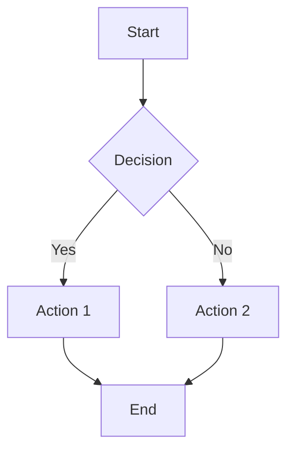

# 📝 Markdown Editor - Full-Stack Frontend Application

A modern, feature-rich markdown editor web application built with React, TypeScript, and Vite. No backend required!

## ✨ Features

### Core Features
- **Live Markdown Editor & Preview**: Real-time markdown editing with instant preview
- **File Management**: Complete file system with folder structure support
- **Admin Authentication**: Secret key-based admin login for edit permissions
- **Role-Based Access**: 
  - **Admin**: Full create/read/update/delete capabilities
  - **Anonymous**: View-only access to preview and existing files

### Advanced Markdown Support
- ✅ **GitHub Flavored Markdown (GFM)** with full GitHub theme styling
- ✅ **Markdown Images** - Full support for image embedding
- ✅ **Markdown Links** - Hyperlinks with proper formatting
- ✅ **Markdown Tables** - Create and render complex tables
- ✅ **Markdown HTML** - Inline HTML support
- ✅ **Math Formulas** - LaTeX/KaTeX support for mathematical expressions
- ✅ **Mermaid Diagrams** - Flowcharts, sequence diagrams, and more

### Editor Features
- ⏪ **Undo/Redo**: Full history support with keyboard shortcuts (Ctrl+Z / Ctrl+Y)
- 🔄 **Synchronize Scroll**: Auto-scroll between editor and preview
- 🌓 **Dark Mode**: Light and dark theme support
- 💾 **Auto-Save**: Automatic file saving to browser localStorage
- ⌨️ **Keyboard Shortcuts**: Tab indentation, Ctrl+Z undo, etc.
- 📊 **File Tree**: Visual hierarchy of files and folders
- 📝 **File Operations**: Create, rename, delete files and folders (admin only)

## 📋 Project Structure

```
markdown-editor/
├── src/
│   ├── components/
│   │   ├── AppHeader.tsx          # Top navigation with controls
│   │   ├── Sidebar.tsx            # File tree and navigation
│   │   ├── FileTree.tsx           # File system component
│   │   ├── Editor.tsx             # Markdown editor textarea
│   │   ├── Preview.tsx            # Markdown preview panel
│   │   ├── AuthModal.tsx          # Admin login modal
│   │   └── *.css                  # Component styles
│   ├── App.tsx                    # Main app component
│   ├── App.css                    # App styles
│   ├── main.tsx                   # React entry point
│   ├── index.css                  # Global styles
│   ├── store.ts                   # Zustand state management
│   └── types.ts                   # TypeScript type definitions
├── index.html                     # HTML entry point
├── vite.config.ts                 # Vite configuration
├── tsconfig.json                  # TypeScript configuration
├── tsconfig.node.json             # TypeScript Node config
├── package.json                   # Dependencies and scripts
├── eslint.config.js               # ESLint configuration
├── .gitignore                     # Git ignore rules
└── README.md                      # This file
```

## 🚀 Getting Started

### Prerequisites
- Node.js (v16.0.0 or higher)
- npm (v8.0.0 or higher) or yarn/pnpm

### Installation

1. **Install Dependencies**
   ```bash
   npm install
   ```

   Or with yarn:
   ```bash
   yarn install
   ```

   Or with pnpm:
   ```bash
   pnpm install
   ```

2. **Verify Installation**
   ```bash
   npm run type-check
   ```

### Development

1. **Start Development Server**
   ```bash
   npm run dev
   ```

   The application will open automatically at `http://localhost:5173`

2. **Keyboard Shortcuts**
   - `Ctrl+Z` / `Cmd+Z`: Undo
   - `Ctrl+Y` / `Ctrl+Shift+Z` / `Cmd+Shift+Z`: Redo
   - `Tab`: Insert 2 spaces (in editor)

3. **Admin Login**
   - Click the 🔐 button at bottom-right
   - Enter admin key: `markdown-editor-admin-2024`
   - Now you can create, edit, and delete files

### Building for Production

1. **Build Optimized Bundle**
   ```bash
   npm run build
   ```

   Output will be in the `dist/` folder

2. **Preview Production Build**
   ```bash
   npm run preview
   ```

   This will serve the production build at `http://localhost:4173`

3. **Deploy to Server**
   - Upload contents of `dist/` folder to your web server
   - Configure your server to serve `index.html` for all routes (SPA)

### Deployment Examples

#### Vercel (Recommended)
```bash
npm install -g vercel
vercel
```

#### Netlify
```bash
npm install -g netlify-cli
netlify deploy --prod --dir=dist
```

#### GitHub Pages
```bash
npm run build
# Push dist/ folder to gh-pages branch
```

## 🎨 Customization

### Change Admin Key
Edit `src/store.ts` and modify the `ADMIN_KEY` constant:
```typescript
const ADMIN_KEY = 'your-custom-admin-key'
```

### Change Markdown Theme
The editor uses GitHub's markdown theme. To customize:
1. Modify CSS variables in `src/components/Preview.css`
2. Adjust color schemes for dark/light modes
3. Customize font preferences in `src/index.css`

### Customize Storage
By default, files are stored in browser's localStorage. To use server storage:
1. Modify `src/store.ts` - Replace localStorage calls with API calls
2. Create a backend API to handle file persistence
3. Update `loadFromStorage` and `saveToStorage` functions

## 📦 Dependencies

### Main Dependencies
- **react**: UI library
- **react-dom**: React DOM bindings
- **react-markdown**: Markdown rendering
- **remark-gfm**: GitHub Flavored Markdown support
- **remark-math**: Math formula support
- **rehype-katex**: KaTeX rendering for math
- **mermaid**: Diagram rendering
- **zustand**: Lightweight state management

### Dev Dependencies
- **typescript**: Type safety
- **vite**: Fast build tool
- **@vitejs/plugin-react**: React support for Vite
- **eslint**: Code linting

## 🧪 Quality Assurance

### Type Checking
```bash
npm run type-check
```

### Linting
```bash
npm run lint
```

## 🌐 Browser Compatibility

- ✅ Chrome/Chromium (latest)
- ✅ Firefox (latest)
- ✅ Safari (latest)
- ✅ Edge (latest)

## 📝 Usage Examples

### Example 1: Basic Markdown
```markdown
# Hello World

This is **bold** and this is *italic*.

- Item 1
- Item 2
- Item 3
```

### Example 2: Tables
```markdown
| Header 1 | Header 2 |
|----------|----------|
| Cell 1   | Cell 2   |
| Cell 3   | Cell 4   |
```

### Example 3: Code Blocks
````markdown
```javascript
function hello() {
  console.log("World");
}
```
````

### Example 4: Math Formula
```markdown
Inline math: $E = mc^2$

Display math:
$$
\frac{-b \pm \sqrt{b^2 - 4ac}}{2a}
$$
```

### Example 5: Mermaid Diagram
````markdown

````

## 🔐 Security Notes

- ⚠️ The admin key is hardcoded for demo purposes only
- ⚠️ All data is stored in browser localStorage (not persistent across devices)
- ⚠️ This is a frontend-only application with no server authentication
- For production use with sensitive data:
  1. Implement proper backend authentication
  2. Use secure password hashing
  3. Add database persistence
  4. Enable HTTPS
  5. Implement rate limiting

## Backend Storage

Enable `BE On` in the toolbar and choose `BE JSON` or `BE MySQL` to synchronize the file tree with FastAPI. Run FastAPI from `backend/fastapi` and configure:

```env
MARKDOWN_STORAGE_BACKEND=json
MARKDOWN_JSON_FILE=data/markdown-files.json
MARKDOWN_ADMIN_KEY=markdown-editor-admin-2024
```

For MySQL, set `MARKDOWN_STORAGE_BACKEND=mysql` and configure the existing `DB_HOST`, `DB_PORT`, `DB_DATABASE`, `DB_USERNAME`, and `DB_PASSWORD` values. The backend creates `markdown_files` on first save. Reads are public; saves require `X-Admin-Key`.

The frontend defaults to `http://localhost:6789/api/v1/markdown/files`; override it with `VITE_MARKDOWN_API_URL`.

## Import and Export

Use `Import` to load a `.md` or `.markdown` file into the active editor. Use `Export` to download the current content as `document.md`.

## 🐛 Troubleshooting

### Port Already in Use
```bash
# Change port in vite.config.ts or use:
npm run dev -- --port 3000
```

### localStorage Full
- Clear browser cache and storage
- Or implement server-side persistence

### Markdown Not Rendering
- Check browser console for errors
- Verify markdown syntax
- Ensure all dependencies are installed

### Dark Mode Not Working
- Clear browser cache
- Refresh the page
- Check browser dev tools for CSS errors

## 📚 Learning Resources

- [Markdown Guide](https://www.markdownguide.org/)
- [GitHub Flavored Markdown](https://github.github.com/gfm/)
- [React Documentation](https://react.dev/)
- [Vite Documentation](https://vitejs.dev/)
- [TypeScript Handbook](https://www.typescriptlang.org/docs/)
- [Mermaid Documentation](https://mermaid.js.org/)

## 📄 License

MIT License - Feel free to use for personal and commercial projects

## 🤝 Contributing

Contributions are welcome! Please feel free to submit issues or pull requests.

## 📞 Support

For issues or questions:
1. Check the troubleshooting section
2. Review existing GitHub issues
3. Create a new issue with detailed information
4. Include browser/OS information and steps to reproduce

---

**Made with ❤️ using React, TypeScript, and Vite**

Happy Markdown Editing! 🎉
