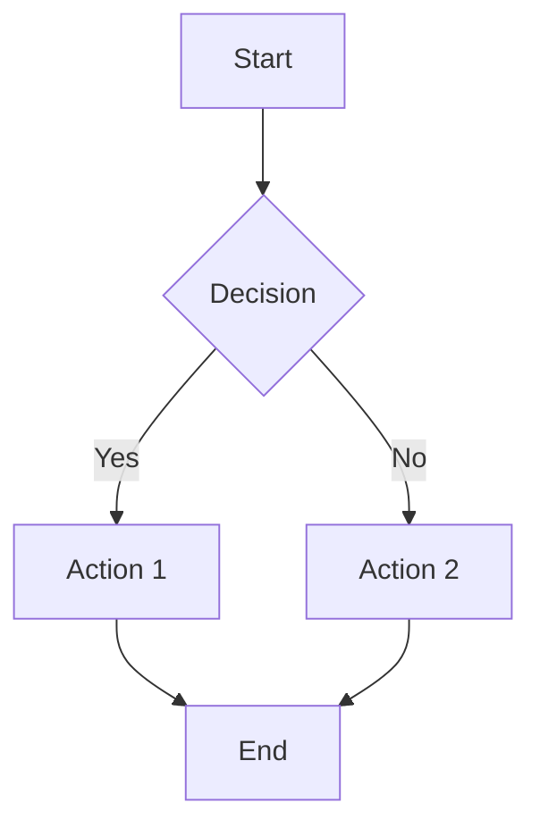

# 📝 Markdown Editor

A markdown editor that runs entirely in the browser: live GitHub-flavoured preview,
a file tree, and optional sync with the FastAPI backend in this repository.

## ✨ Features

### Writing
- **Formatting toolbar and shortcuts** for headings, bold, italic, strikethrough, inline
  code, code blocks, lists, task lists, quotes, links, images, tables and rules —
  all of which *toggle* rather than blindly inserting
- **Smart list continuation**: Enter extends and renumbers lists, and outdents out of them
- **Multi-line indent/outdent**, duplicate, move and delete lines
- **Selection-aware paste**: a pasted URL becomes a link, a pasted image is embedded
- **Find and replace** with case, whole-word and regular-expression modes
- **Measured line-number gutter** that stays aligned even with word wrap on
- **Coalesced undo** — a burst of typing is one undo step, capped at 200 entries

### Preview
- **GitHub Flavored Markdown**: tables, task lists, footnotes, strikethrough
- **KaTeX maths**, **Mermaid diagrams** (loaded on demand), **syntax-highlighted code**
- **Sanitised inline HTML**, so a document from the shared backend cannot inject scripts
- **Line-accurate scroll sync** in both directions, plus double-click to jump between a
  rendered block and the source line that produced it
- **Interactive task lists**: ticking a checkbox in the preview edits the source
- Heading anchors, per-block copy buttons, and readable errors for malformed diagrams

### Workspace
- **Command palette** (Ctrl+Shift+P) over commands, files and headings, with fuzzy matching
- **Document outline** panel built from the headings
- **File tree** with drag-and-drop, inline rename, duplicate, filter and automatic
  de-duplication of names
- **Status bar**: save state, word and line counts, reading time, cursor position, zoom
- **Light / dark / system theme**, resizable panes and sidebar, distraction-free mode
- **Export** to Markdown, self-contained HTML, PDF, PNG or JPG, plus a real print stylesheet

### Access and storage
- **Admin key unlocks editing**; anonymous visitors can read, search and export
- The admin flag lives in memory only — it is never written to storage
- **Auto-save** to localStorage, debounced, with the last successful save shown
- **Optional FastAPI backend sync** (JSON file or MySQL), with errors reported in plain language

## 📋 Project Structure

```
markdown-editor/
├── src/
│   ├── components/
│   │   ├── Header.tsx             # Top bar: menus, view mode, theme, role
│   │   ├── Sidebar.tsx            # Files / Outline tabs
│   │   ├── FileTree.tsx           # Drag-and-drop tree
│   │   ├── Outline.tsx            # Headings of the open document
│   │   ├── EditorPane.tsx         # Textarea, gutter, measuring mirror, shortcuts
│   │   ├── FormatToolbar.tsx      # Formatting actions
│   │   ├── FindReplace.tsx        # Find and replace bar
│   │   ├── Preview.tsx            # react-markdown pipeline
│   │   ├── CodeBlock.tsx          # Highlighted code with a copy button
│   │   ├── MermaidDiagram.tsx     # Lazily loaded diagrams
│   │   ├── CommandPalette.tsx     # Ctrl+Shift+P
│   │   ├── StatusBar.tsx          # Save state and document statistics
│   │   ├── AuthModal.tsx          # Admin unlock
│   │   ├── HelpModal.tsx          # Help and shortcut reference
│   │   ├── Toasts.tsx             # Transient notifications
│   │   ├── Icons.tsx              # Inline SVG icon set
│   │   └── *.css                  # Component styles
│   ├── lib/                       # Pure, unit-tested logic
│   │   ├── tree.ts                # File-tree operations
│   │   ├── editorCommands.ts      # Text transforms on a selection
│   │   ├── markdown.ts            # Headings, statistics, search, line mapping
│   │   ├── paneSync.ts            # Line-based scroll sync
│   │   ├── rehypeEnhance.ts       # data-line stamps, anchors, sanitize schema
│   │   ├── persistence.ts         # Versioned localStorage with migration
│   │   ├── exporters.ts           # Markdown/HTML/PDF/image export, clipboard
│   │   ├── fuzzy.ts               # Command palette matching
│   │   └── id.ts                  # Collision-free ids
│   ├── services/markdownStorage.ts # FastAPI client
│   ├── __tests__/                 # Store and component tests
│   ├── test/setup.ts              # Vitest/jsdom setup
│   ├── App.tsx                    # Shell, layout, global shortcuts
│   ├── store.ts                   # Zustand state and actions
│   ├── types.ts                   # Shared types
│   └── index.css                  # Design tokens, reset, markdown styles
├── index.html
├── vite.config.ts                 # Build + Vitest configuration
├── tsconfig.json / tsconfig.node.json
├── eslint.config.js               # Flat config, typescript-eslint
└── package.json
```

## 🚀 Getting Started

### Prerequisites
- Node.js (v16.0.0 or higher)
- npm (v8.0.0 or higher) or yarn/pnpm

### Installation

1. **Install Dependencies**
   ```bash
   npm install
   ```

   Or with yarn:
   ```bash
   yarn install
   ```

   Or with pnpm:
   ```bash
   pnpm install
   ```

2. **Verify Installation**
   ```bash
   npm run type-check
   ```

### Development

1. **Start Development Server**
   ```bash
   npm run dev
   ```

   The application will open automatically at `http://localhost:5173`

2. **Keyboard Shortcuts**
   - `Ctrl+Z` / `Cmd+Z`: Undo
   - `Ctrl+Y` / `Ctrl+Shift+Z` / `Cmd+Shift+Z`: Redo
   - `Tab`: Insert 2 spaces (in editor)

3. **Admin Login**
   - Click the 🔐 button at bottom-right
   - Enter admin key: `markdown-editor-admin-2024`
   - Now you can create, edit, and delete files

### Building for Production

1. **Build Optimized Bundle**
   ```bash
   npm run build
   ```

   Output will be in the `dist/` folder

2. **Preview Production Build**
   ```bash
   npm run preview
   ```

   This will serve the production build at `http://localhost:4173`

3. **Deploy to Server**
   - Upload contents of `dist/` folder to your web server
   - Configure your server to serve `index.html` for all routes (SPA)

### Deployment Examples

#### Vercel (Recommended)
```bash
npm install -g vercel
vercel
```

#### Netlify
```bash
npm install -g netlify-cli
netlify deploy --prod --dir=dist
```

#### GitHub Pages
```bash
npm run build
# Push dist/ folder to gh-pages branch
```

## 🎨 Customization

### Change the admin key
Set it at build time so it does not have to be edited in source:
```bash
# .env.local
VITE_MARKDOWN_ADMIN_KEY=your-custom-admin-key
VITE_MARKDOWN_API_URL=http://localhost:6789/api/v1/markdown/files
```
It must match the backend's `MARKDOWN_ADMIN_KEY`. Without the variable the default
`markdown-editor-admin-2024` is used.

> The key only gates the UI; it ships in the bundle. Real protection comes from the
> backend, which requires `X-Admin-Key` on every write.

### Restyle the app
Every colour, radius, shadow and font is a CSS custom property declared at the top of
`src/index.css`. Light is the base palette and `:root[data-theme='dark']` re-declares
only the colours, so a token added once works in both themes. Markdown styles are scoped
to `.markdown-body`, so they never leak into the application chrome.

### Customize Storage
By default, files are stored in browser's localStorage. To use server storage:
1. Modify `src/store.ts` - Replace localStorage calls with API calls
2. Create a backend API to handle file persistence
3. Update `loadFromStorage` and `saveToStorage` functions

## 📦 Dependencies

### Main Dependencies
- **react** / **react-dom**: UI library
- **zustand**: state management
- **react-markdown** + **remark-gfm**, **remark-math**: parsing and GFM
- **rehype-katex**: maths rendering
- **rehype-raw** + **rehype-sanitize**: inline HTML, safely
- **react-syntax-highlighter**: code highlighting (async-light build, one grammar per language)
- **mermaid**: diagrams, dynamically imported
- **html2canvas** + **jspdf**: image and PDF export, dynamically imported

### Dev Dependencies
- **typescript**, **vite**, **@vitejs/plugin-react**
- **vitest**, **jsdom**, **@testing-library/react**, **@testing-library/user-event**, **@testing-library/jest-dom**
- **eslint**, **typescript-eslint**, **eslint-plugin-react-hooks**, **eslint-plugin-react-refresh**

### Bundle
Mermaid, html2canvas, jsPDF and the Prism grammars are all loaded on demand, so the
initial payload is roughly 950 kB uncompressed (~250 kB gzipped) rather than one
monolithic chunk.

## 🧪 Quality Assurance

```bash
npm run type-check   # tsc --noEmit
npm run lint         # eslint (flat config, typescript-eslint, react-hooks)
npm test             # vitest run
npm run test:watch   # vitest in watch mode
npm run coverage     # coverage for src/lib and src/store.ts
npm run build        # tsc -b && vite build
```

The suite covers the pure logic in `src/lib` (tree operations, editor commands,
markdown parsing, search, scroll mapping, fuzzy matching), the Zustand store
(history coalescing, admin gating, persistence and its legacy migration), and the
interactive components with Testing Library.

## 🌐 Browser Compatibility

- ✅ Chrome/Chromium (latest)
- ✅ Firefox (latest)
- ✅ Safari (latest)
- ✅ Edge (latest)

## 📝 Usage Examples

### Example 1: Basic Markdown
```markdown
# Hello World

This is **bold** and this is *italic*.

- Item 1
- Item 2
- Item 3
```

### Example 2: Tables
```markdown
| Header 1 | Header 2 |
|----------|----------|
| Cell 1   | Cell 2   |
| Cell 3   | Cell 4   |
```

### Example 3: Code Blocks
````markdown
```javascript
function hello() {
  console.log("World");
}
```
````

### Example 4: Math Formula
```markdown
Inline math: $E = mc^2$

Display math:
$$
\frac{-b \pm \sqrt{b^2 - 4ac}}{2a}
$$
```

### Example 5: Mermaid Diagram
````markdown

````

## 🔐 Security Notes

What the app does do:

- The admin flag lives in memory only. It is never written to storage, so a reload
  always returns to view-only and a tampered localStorage cannot grant admin.
- Settings restored from storage are filtered against a known key list, so an unknown
  field in the payload cannot inject state.
- Inline HTML in a document is sanitised (`rehype-raw` then `rehype-sanitize`) before it
  reaches the DOM, so a file loaded from the shared backend cannot run script. Mermaid
  runs at `securityLevel: 'strict'`.
- Writes to the backend require the `X-Admin-Key` header, which the server verifies.

What it does not:

- ⚠️ The admin key ships in the frontend bundle. It gates the UI, not the data — anyone
  can read the key from the build. The backend's check is the real boundary.
- ⚠️ Local data lives in this browser only; it does not follow you across devices.
- For production use with sensitive content: put real authentication in front of the API,
  serve over HTTPS, and rate-limit the write endpoint.

## Backend Storage

Enable `BE On` in the toolbar and choose `BE JSON` or `BE MySQL` to synchronize the file tree with FastAPI. Run FastAPI from `backend/fastapi` and configure:

```env
MARKDOWN_STORAGE_BACKEND=json
MARKDOWN_JSON_FILE=data/markdown-files.json
MARKDOWN_ADMIN_KEY=markdown-editor-admin-2024
```

For MySQL, set `MARKDOWN_STORAGE_BACKEND=mysql` and configure the existing `DB_HOST`, `DB_PORT`, `DB_DATABASE`, `DB_USERNAME`, and `DB_PASSWORD` values. The backend creates `markdown_files` on first save. Reads are public; saves require `X-Admin-Key`.

The frontend defaults to `http://localhost:6789/api/v1/markdown/files`; override it with `VITE_MARKDOWN_API_URL`.

## Import and Export

Use `Import` to load a `.md` or `.markdown` file into the active editor. Use `Export` to download the current content as `document.md`.

## 🐛 Troubleshooting

### Port Already in Use
```bash
# Change port in vite.config.ts or use:
npm run dev -- --port 3000
```

### localStorage Full
- Clear browser cache and storage
- Or implement server-side persistence

### Markdown Not Rendering
- Check browser console for errors
- Verify markdown syntax
- Ensure all dependencies are installed

### Dark Mode Not Working
- Clear browser cache
- Refresh the page
- Check browser dev tools for CSS errors

## 📚 Learning Resources

- [Markdown Guide](https://www.markdownguide.org/)
- [GitHub Flavored Markdown](https://github.github.com/gfm/)
- [React Documentation](https://react.dev/)
- [Vite Documentation](https://vitejs.dev/)
- [TypeScript Handbook](https://www.typescriptlang.org/docs/)
- [Mermaid Documentation](https://mermaid.js.org/)

## 📄 License

MIT License - Feel free to use for personal and commercial projects

## 🤝 Contributing

Contributions are welcome! Please feel free to submit issues or pull requests.

## 📞 Support

For issues or questions:
1. Check the troubleshooting section
2. Review existing GitHub issues
3. Create a new issue with detailed information
4. Include browser/OS information and steps to reproduce

---

**Made with ❤️ using React, TypeScript, and Vite**

Happy Markdown Editing! 🎉
