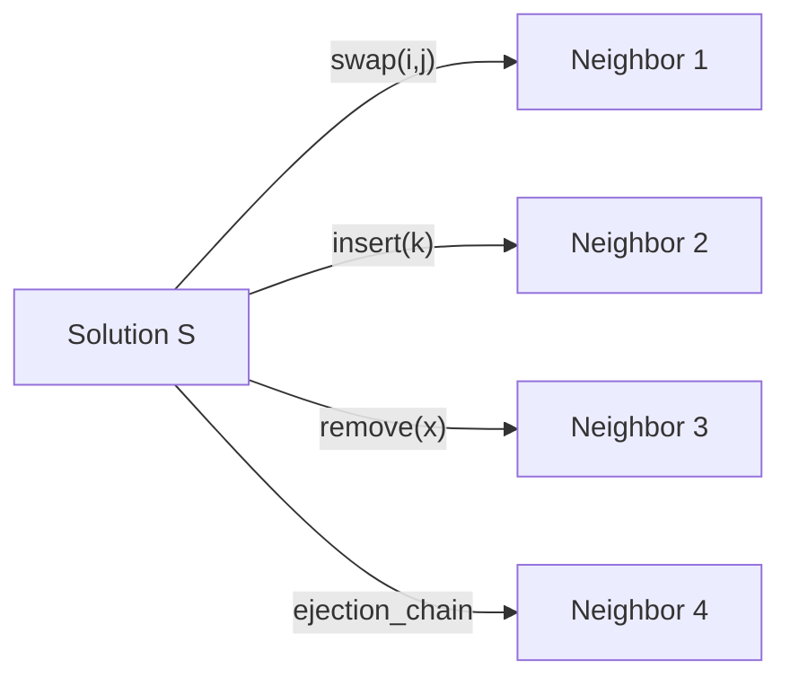
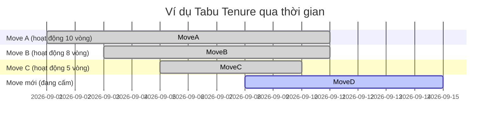

# Tóm tắt điều hành

Tabu Search (TS) là một meta-heuristic mạnh mẽ dùng để giải các bài tối ưu tổ hợp khó, đặc biệt bài NP-hard. Điểm nổi bật của TS là sử dụng **bộ nhớ thích nghi** (adaptive memory) để tránh lặp lại các nghiệm đã xem và mở rộng vùng tìm kiếm. Cụ thể, TS duy trì một **Tabu List** – danh sách các thuộc tính hoặc động tác đã được dùng gần đây – nhằm ngăn thuật toán quay lại các nghiệm cũ. Đồng thời, TS có cơ chế **aspiration** cho phép lật ngược ràng buộc Tabu nếu động tác dẫn đến nghiệm tốt hơn nghiệm tốt nhất hiện có. TS còn thiết kế các chiến lược **cường hoá (intensification)** và **đa dạng hóa (diversification)** để tập trung khám phá các vùng nghiệm có tiềm năng cao hoặc tìm kiếm ở những vùng mới trong không gian giải pháp. Nhờ vậy, TS có thể vượt qua cực tiểu cục bộ tốt hơn các thuật toán tìm kiếm cục bộ thông thường và thường thu được nghiệm rất gần với tối ưu. 

Báo cáo này tổng hợp lịch sử phát triển, các thành phần chính (tabu list, aspiration, memory, v.v.), thiết kế neighborhood (swap/insert/remove, ejection chain, path-relinking), công thức tính Δ (delta) nhanh các động tác, điều chỉnh tham số (tabu tenure, tiêu chí aspiration, ngắt số lần không cải thiện, v.v.), các mô hình lai (TS+LS, TS+SA, TS+MIP, TS+LNS), đặc tính lý thuyết (không đảm bảo tối ưu, quan điểm Markov), chi tiết triển khai C++ (cấu trúc dữ liệu, kiểm tra tabu hiệu quả, seed ngẫu nhiên, điều khiển thời gian, song song hóa), và các ví dụ thực tế trên TSP, VRP, JSSP, QAP cùng các kết quả điển hình. Ngoài ra, báo cáo nêu chi tiết cách áp dụng TS cho bài toán “Máy lạnh” (Air Conditioner) như một hướng dẫn bước từng bước cho contest, bao gồm giải pháp khởi tạo, tập neighborhood, các thuộc tính tabu, xử lý ràng buộc, và thủ thuật delta-eval. Cuối cùng trình bày các lưu ý, checklist debug, gợi ý thử nghiệm và bảng tham số.  

# 1. Lịch sử và tài liệu gốc

TS do Fred Glover đề xuất lần đầu năm 1986 trong bài “Future paths for integer programming and links to AI” (và tiếp theo là các bài báo ORSA/JOC những năm 1989–1999). Glover cũng phối hợp với Laguna xuất bản các sách và chương sách kinh điển, đặc biệt cuốn *Tabu Search* (1997) trình bày tổng quan các ý tưởng và ứng dụng. Các tài liệu này chính là nguồn tham khảo khởi đầu cho TS. Trong ngành, nhiều bài báo nổi tiếng ứng dụng TS vào TSP, QAP, JSSP, VRP… Gần đây, các tác giả như Glover (2003), Blum & Roli (2003) đã tóm tắt khái niệm *intensification/diversification* vốn bắt nguồn từ TS. Nhiều thuật toán cải tiến và biến thể TS (như *Reactive TS*, *Guided Local Search*, *GRASP with path-relinking*, v.v.) đều dựa trên nền tảng các ý tưởng của Glover. Hiện nay TS vẫn là công cụ cơ bản trong tối ưu tổ hợp, được đưa vào phần mềm như OR-Tools (có hỗ trợ thuật toán Local Search mạnh mẽ) và là tiền đề cho các solver tiên tiến (ví dụ LKH cho TSP cũng kết hợp tư tưởng cấm lặp và di chuyển ngẫu nhiên).  

# 2. Định nghĩa và Pseudocode

TS là thuật toán tìm kiếm cục bộ có bộ nhớ. Mục tiêu là tối ưu hàm mục tiêu \(f(s)\) (min hoặc max) trên không gian nghiệm \(S\). Bắt đầu từ nghiệm khởi tạo \(s\), TS lặp lại bước sau cho đến thoả điều kiện dừng (số vòng, thời gian, độ không cải thiện liên tiếp, v.v.):

1. **Tạo tập hàng xóm** \(N(s)\) từ nghiệm hiện tại \(s\) (bằng một hay nhiều move như swap, insert, v.v.).  
2. **Chọn ứng viên**: Chọn nghiệm con \(s'\in N(s)\) tốt nhất không bị cấm (không có thuộc tính tabu) hoặc nếu bị cấm thì thỏa tiêu chí aspiration (ví dụ tạo nghiệm tốt hơn nghiệm tốt nhất hiện tại). Ghi nhận nếu \(s'\) tốt hơn \(s_{\text{best}}\) (nghiệm tốt nhất tìm được) thì cập nhật \(s_{\text{best}}=s'\).  
3. **Cập nhật hiện tại**: Đặt \(s \leftarrow s'\).  
4. **Cập nhật Tabu List**: Ghi lại thuộc tính của move vừa dùng (có thể là biến bị đổi, cạnh bị xoá/thêm, v.v.) vào danh sách tabu ngắn hạn. Mỗi thuộc tính tabu được gắn độ dài (tabu tenure) – số vòng thuật toán mà nó bị cấm dùng. Sau mỗi vòng, giảm tuổi thọ của các mục trong danh sách và xóa những mục đã hết hạn.  
5. Tăng bộ đếm vòng, lặp lại từ bước 1.

Quy trình trên được minh hoạ bằng pseudocode sau (dưới đây là biểu diễn tối giản):

```mermaid
flowchart TD
    A[Khởi tạo: s, s_best = s, TabuList = \u2070] --> B[Tạo tập N(s) từ hàng xóm của s]
    B --> C[Tìm s' = arg min\_{x\in N(s)} f(x) với x không tabu hoặc x thoả aspiration]
    C --> D[Cập nhật: nếu f(s') < f(s\_best) thì s\_best = s'; s = s']
    D --> E[Cập nhật TabuList: thêm thuộc tính của move vừa dùng; giảm tuổi thọ và loại bỏ mục hết hạn]
    E --> F{Dừng?\n(có thể dùng giới hạn vòng lặp, thời gian, hay\nkhông cải thiện trong K vòng)}
    F -->|Chưa| B
    F -->|Có| G[Kết thúc, trả về s\_best]
```

Mã giả trên chủ yếu minh hoạ quá trình TS. Ta nhấn mạnh hai điểm: (*) TS **có thể chấp nhận** nghiệm \(s'\) kém hơn nghiệm hiện tại \(s\) để thoát local optimum; và (*) thuật toán ghi nhớ các move/tabu để tránh quay vòng. 

Dựa vào [7], ta có thể diễn đạt thuật toán như sau: 

> Tabu Search là một thuật toán tìm kiếm cục bộ cho các bài toán tổ hợp, duy trì một danh sách tabu chứa các move/thuộc tính đã dùng trong một số vòng trước đó. Tại mỗi vòng, tập hàng xóm \(N(s)\) của nghiệm hiện tại \(s\) được sinh ra. Sau đó, chọn nghiệm ứng viên tốt nhất \(s'\) trong \(N(s)\) mà không bị cấm (hoặc bị cấm nhưng thỏa **tiêu chí aspiration**). Nghiệm chọn được làm **nghiệm hiện tại** (dù có thể kém hơn) và nếu nó tốt hơn nghiệm tốt nhất trước đó thì cập nhật nghiệm tốt nhất. Cuối cùng, thuộc tính của move tạo ra \(s'\) được thêm vào Tabu List và các mục cũ được xóa khi hết tenure. Quá trình này lặp đến khi thoả dừng (số vòng hoặc thời gian). 

Ta cũng ghi nhận: 

- Mục đích ngăn lặp: Tabu Search “nâng cao tìm kiếm cục bộ bằng cách tránh các điểm không gian nghiệm đã xem qua. Nhờ vậy tránh lặp đường đi và thoát được khỏi các cực tiểu cục bộ”. 
- Tabu List và Tabu Tenure: Mỗi mục trong Tabu List bị cấm một số vòng xác định (tuổi thọ). Việc cấm này được gọi **tabu tenure** và thường được điều chỉnh theo kích thước bài toán. Ví dụ heuristics phổ biến là chọn tabu tenure từ 7–20 tùy problem size.
- Tiêu chí Aspiration: Nếu một động tác bị cấm nhưng sinh ra nghiệm tốt vượt mức tốt nhất tìm được, thì vẫn cho phép dùng (over-ride Tabu). Cách làm phổ biến: “cho phép một move tabu nếu nó dẫn đến nghiệm tốt hơn nghiệm tốt nhất hiện tại”. Các tiêu chí khác cũng có thể dùng như: cho phép nếu biến chưa bị đổi trong nhiều vòng, v.v. 

# 3. Thành phần chính của Tabu Search

TS gồm bốn thành phần quan trọng: **Tabu List (short-term memory)**, **Tiêu chí aspiration**, **Hồi hướng (intensification)** và **Đa dạng hoá (diversification)** (kết hợp intermediate/long-term memory). 

## 3.1. Tabu List và Tabu Tenure

- **Tabu List (Danh sách cấm)**: Là bộ nhớ ngắn hạn lưu trữ các thuộc tính của các move vừa dùng. Ví dụ, trong bài TSP, có thể cấm lắp lại một cặp đỉnh đã bị xoá; trong phân hoạch, cấm lắp lại nhóm đã đổi vị trí; trong bài khác, cấm lật giá trị của một biến. Bằng cách này, TS “không cho phép quay trở lại các nghiệm đã được thăm gần đây”.
- **Tabu Tenure (Thời hạn cấm)**: Mỗi mục trong Tabu List chỉ bị cấm trong một số vòng (iteration) nhất định. Sau khi một move trở thành tabu, nó sẽ bị ghi thành các mục trong Tabu List kèm tuổi thọ. Mỗi vòng lặp, độ tuổi giảm đi và khi tuổi thọ về 0 thì move đó được gỡ bỏ khỏi Tabu List. Tabu tenure có thể cố định hoặc thay đổi động. Cách phổ biến là chọn giá trị tuỳ vào quy mô problem (ví dụ với n biến thì tenure ~5–15 cho bài cỡ vừa). Chọn nhỏ tenure có thể lead đến khai thác cục bộ triệt để (tăng nguy cơ lặp lại), chọn lớn tenure giúp đa dạng hoá nhưng tăng độ ngẫu nhiên. 
- **Thuộc tính Move**: Cần lưu “thuộc tính” của move thay vì nghiệm đầy đủ vì lưu cả nghiệm là không cần thiết và lãng phí. Ví dụ, với swap hai phần tử A và B, ta lưu “(A,B) đã bị đảo vị trí”. Mỗi problem có cách chọn thuộc tính phù hợp. Việc xác định đúng thuộc tính đóng vai trò quan trọng trong hiệu quả của TS.  

## 3.2. Tiêu chí Aspiration

Một move trong Tabu List sẽ bị bỏ qua nếu không thỏa tiêu chí aspiration. Mục đích là không đánh mất những đột phá quan trọng. Tiêu chí phổ biến nhất: **cho phép move tabu nếu tạo ra nghiệm vượt qua (cải thiện) nghiệm tốt nhất hiện có**. Nghĩa là, nếu \(f(s')<f(s_{\rm best})\) (minimization), thì cho phép chọn \(s'\) dù nguyên lý tabu. Theo thuật toán chuẩn: “nếu move được chọn nằm trong Tabu List thì chỉ được chấp nhận nếu nó thoả tiêu chí aspiration cho phép ghi đè trạng thái tabu khi nó dẫn đến nghiệm tốt hơn nghiệm tốt nhất hiện có”. Ngoài ra, có thể dùng tiêu chí phụ như: “nếu thuộc tính tabu này chưa xuất hiện trong K vòng thì cho phép lại”, hoặc “nếu nghiệm mới đạt giá trị mục tiêu”, tùy biến theo bài. Dù vậy, ý tưởng chính là ưu tiên các move tạo đột phá.

## 3.3. Đa dạng hoá và tập trung hoá (Diversification & Intensification)

TS sử dụng **bộ nhớ dài hạn/intermediate** để thúc đẩy *cường hoá* (intensification) và *đa dạng hoá* (diversification) tìm kiếm. 

- **Cường hoá (Intensification)**: Tập trung tìm kiếm kỹ hơn trong vùng chứa nhiều nghiệm tốt. Ví dụ, giữ lại những nghiệm ưu tú (elite solutions) từ trước, sau đó từ đó khảo sát kỹ lưỡng các giải pháp lân cận. Hoặc có thể ghi nhớ tần suất xuất hiện của các đặc trưng tốt (ví dụ cặp biến tốt) và khuyến khích các move liên quan. Theo Glover & Laguna (1997): trong giai đoạn cường hoá, “thuật toán tập trung vào việc khảo sát lân cận của các nghiệm ưu tú để tìm sâu hơn”. Kỹ thuật có thể là khởi động lại từ nghiệm tốt nhất, hoặc sử dụng neighborhood chuyên sâu hơn (ví dụ dùng move phức tạp hơn) xung quanh các nghiệm này.
- **Đa dạng hoá (Diversification)**: Khuyến khích khám phá các vùng mới của không gian nghiệm, tránh kẹt vào một khu vực. Ví dụ, có thể thêm các ràng buộc tạm thời để dịch chuyển vị trí hiện tại đến phần khác của không gian, hoặc khởi động lại với nghiệm ngẫu nhiên hoặc bán-ngẫu nhiên sau một số vòng. Glover & Laguna định nghĩa: “giai đoạn đa dạng khuyến khích quy trình tìm kiếm khảo sát các vùng chưa từng đến, tạo ra những nghiệm khác biệt đáng kể so với những nghiệm đã thấy”. Bằng cách này, TS có thể vượt qua plateau hoặc lối mòn thưa. Một cách triển khai là dùng **bộ nhớ dài hạn** để ghi lại tần suất xuất hiện của các giá trị và so sánh, sau đó tìm cách né các khu vực được thăm nhiều.

**Tóm lại**, TS sử dụng nhiều dạng bộ nhớ:
- *Bộ nhớ ngắn hạn*: Tabu List (thuộc tính move) để ngăn tái lặp.
- *Bộ nhớ trung hạn*: Lưu trữ nghiệm tốt, thống kê đặc trưng thường xuất hiện, hỗ trợ cường hoá.
- *Bộ nhớ dài hạn*: Lưu tần suất chung của các move/thuộc tính, điều khiển đa dạng hoá (ví dụ, nếu một thành phần hiện diện quá nhiều lần, ưu tiên thay đổi nó).

Tất cả phối hợp giúp TS cân bằng giữa khám phá (diversification) và khai thác (intensification), qua đó **mở rộng phạm vi tìm kiếm mà không mất hoàn toàn khả năng hội tụ**.

# 4. Thiết kế neighborhood và move

TS là một thuật toán *local search*, nên quan trọng nhất là định nghĩa các *move* (động tác chuyển) và tập *hàng xóm* (neighborhood) phù hợp cho bài toán cụ thể. Một move biến đổi nghiệm hiện tại theo cách nào đó, tạo ra một nghiệm láng giềng. Dưới đây là các ví dụ điển hình:

- **Swap (Hoán vị)**: Chọn hai vị trí trong nghiệm (hoặc hai phần tử của nghiệm) và đổi chỗ chúng. Ví dụ, với hoán vị của TSP, swap hai đỉnh trong tour: \(..., A,B, ...\) thành \(..., B,A, ...\). Hoặc trong bài xếp lịch (Job sequencing), swap vị trí hai công việc. Swap thường tạo ra hội con size \(O(n^2)\) (tất cả cặp). Cần tính delta của swap nhanh: ví dụ TSP, swap hai đỉnh ảnh hưởng tối đa 4 cạnh trong tour (cập nhật bằng cộng trừ trọng số các cạnh cũ mới).
- **Insert (Cấy chèn)**: Chọn một phần tử và chèn nó vào vị trí khác. Ví dụ TSP: xóa đỉnh ở vị trí i, rồi chèn vào vị trí j; hay cho bài xếp lịch, lấy một job và chèn qua chỗ khác. Neighborhood dạng này size khoảng \(O(n^2)\) (chọn vị trí và nơi chèn). Delta-ví dụ: ở TSP, xóa 3 cạnh, nối thêm 3 cạnh; tính nhanh trong \(O(1)\) tương tự 2-opt (xem dưới).
- **Remove/Add (Loại/bổ sung)**: Dùng cho bài chọn tập (ví dụ Set Cover) hoặc VRP: loại bỏ một phần tử khỏi nghiệm (Ví dụ đóng một cửa hàng) rồi bù lại phần tử khác. Hoặc thực hiện `remove` một job khỏi lịch (như scheduling), với ràng buộc thời gian/công suất có thể bị vi phạm.
- **2-opt (Dành cho chu trình TSP)**: Một move đặc biệt mạnh. Giả sử tour gồm các cạnh \((A,B)\) và \((C,D)\) được chọn. Sau khi thực hiện 2-opt, tour sẽ thay bằng các cạnh \((A,C)\) và \((B,D)\) và đảo ngược đoạn nằm giữa B và C. Hình dưới minh hoạ 2-opt:

```mermaid
flowchart LR
    subgraph before "Trước 2-opt"
        A --> B
        B --> C
        C --> D
        D --> E
    end
    subgraph after "Sau 2-opt (cắt ở AB và DE)"
        A --> B
        A --> C
        B --> D
        C --> E
        D --> B
        E --> C
    end
```

  Với 2-opt, chỉ 4 cạnh bị đổi (từ 2 thành 2), nên có thể tính Δ rất nhanh: 
  \[
    \Delta = d(A,C) + d(B,D) - (d(A,B) + d(C,D)).
  \]
  Lưu ý tùy theo cách biểu diễn, thường mã sẽ xét hai nút liền kề để cập nhật chi phí. Phức tạp so sánh: có \(O(n^2)\) cặp cạnh để thử, mỗi cặp tính \(O(1)\) ⇒ toàn bộ neighborhood 2-opt cần \(O(n^2)\) thời gian để tìm best.
- **3-opt (và k-opt)**: Mở rộng 2-opt, cắt 3 cạnh và nối lại 3 đoạn theo một trong nhiều cách (thường 7 cách khác nhau). Mạnh hơn 2-opt và có khả năng thoát nhiều local optimum hơn, nhưng xét tất cả kết hợp có thể lên đến \(O(n^3)\). Lin-Kernighan (LKH) là ví dụ nâng cao nhất của k-opt biến thiên, tự quyết định “độ k” sao cho hiệu quả nhất.
- **Ejection Chain**: Một dãy đuổi (chain) động tác, ví dụ trong bài xếp xe (vehicle routing), ta có thể “đuổi” một khách từ tuyến A qua tuyến B, đẩy khách khác sang tuyến C, v.v. Các chuỗi ejection chain tạo ra động tác phức tạp liên tiếp, khám phá neighborhood lớn hơn.
- **Path Relinking**: Mặc dù gốc là kỹ thuật của Scatter Search, TS có thể dùng để cường hoá: thực hiện một đường “di cư” liên tục giữa hai nghiệm xuất sắc, mỗi bước thực hiện move hướng đến nghiệm kia. 

**Ví dụ Delta-evaluation**: Để chạy TS hiệu quả, cần tính nhanh hiệu ứng của move mà không cần xây lại toàn bộ nghiệm. Ví dụ TSP 2-opt phía trên chỉ cần cộng trừ 4 cạnh. Swap hai phần tử trong một permutation dài (chẳng hạn bài xếp lịch bất định) có thể tính Δ bằng cách loại bỏ chi phí liên quan với hai vị trí và thêm chi phí mới. Insert tương tự. Cần cẩn thận khi nhiều ràng buộc (capacities, windows) bị vi phạm; thường cộng thêm penalty.

Bảng dưới đây tóm tắt độ phức tạp của một vài move quen thuộc trên hoán vị kích thước \(n\):

- **Swap**: \(O(n^2)\) ứng viên, mỗi ứng viên cập nhật \(O(1)\) nếu có delta smart (ví dụ TSP cập nhật 4 cạnh).  
- **Insert**: \(O(n^2)\) ứng viên, cập nhật \(O(1)\) (TSP cập nhật 4 cạnh).  
- **2-opt**: \(O(n^2)\) ứng viên (chọn cặp cạnh), mỗi cặp cập nhật \(O(1)\) (4 cạnh).  
- **3-opt**: \(O(n^3)\) ứng viên, mỗi cặp cập nhật \(O(1)\) (6 cạnh).  
- **Remove/Add**: Với bài chọn tập hoặc VRP, số ứng viên ≈ \(O(n)\) (xóa hay thêm 1 mục), cập nhật tùy từng bối cảnh.

Việc thiết kế neighborhood phải đảm bảo cân bằng giữa **đủ lớn** (không gian tìm kiếm phong phú) và **đủ nhỏ** (ít ứng viên, cho phép duyệt nhanh).  

# 5. Triển khai chi tiết

## 5.1. Cấu trúc dữ liệu và kiểm tra Tabu

Trong C++, Tabu List có thể hiện thực bằng các cấu trúc như:
- **Queue hoặc deque** giữ các mục tabu theo thứ tự thời gian vào, giúp dễ xoá mục già nhất. Ví dụ `std::deque<TabuMove> tabuList;`.
- **Bảng/ma trận** đánh dấu trực tiếp: ví dụ bài TSP có thể dùng ma trận cấm cạnh; bài có biến rời rạc (0-1) có thể dùng mảng đếm tuổi thọ. Ví dụ, nếu move là swap hai đỉnh i,j, ta có thể có mảng 2D `int tabuTime[N][N] = {0}`; khi swap (i,j) thì đặt `tabuTime[i][j] = tenure` và mỗi vòng giảm hết. Kiểm tra một move có tabu chỉ cần xem `tabuTime[i][j] > 0`.
- **Bảng hash/mapping**: Nếu không dễ dùng ma trận, có thể dùng `unordered_map` lưu map từ thuộc tính move sang tuổi thọ.

Yêu cầu: Việc kiểm tra một move có bị tabu phải nhanh (O(1) hoặc ít nhất không quá lớn). Do đó nên gán cho mỗi move/thuộc tính một chỉ số hoặc key cố định.

Ví dụ mã C++ đơn giản (không tối ưu) về Tabu List kiểu hàng đợi của các vector nghiệm (chỉ mang tính minh hoạ):

```cpp
vector<vector<int>> tabuList;
int tabuTenure = 10;
...
// Kiểm tra neighbor không trong tabuList
bool isTabu(const vector<int>& cand) {
    return find(tabuList.begin(), tabuList.end(), cand) != tabuList.end();
}
// Sau khi chọn bestNeighbor:
tabuList.push_back(bestNeighbor);
if (tabuList.size() > tabuTenure) {
    tabuList.erase(tabuList.begin());
}
```

Mã trên từ G4G. Tuy nhiên lưu cả nghiệm là nặng. Cách tốt hơn là lưu *đặc trưng move* (chẳng hạn đôi chỉ số swap). 

Ví dụ lưu swap `(i,j)` cho TS trên mảng:
```cpp
deque<pair<int,int>> tabuSwap;
...
// khi swap vị trí i và j:
tabuSwap.push_back({i,j});
// nếu quá tenure:
if (tabuSwap.size() > tabuTenure) 
    tabuSwap.pop_front();
```
Kiểm tra chỉ cần so sánh cặp `(i,j)`. (Riêng lưu *cạnh* cho TSP: lưu 2 cặp đỉnh, v.v.)

## 5.2. Ghi nhận nghiệm tốt nhất

Như đã nhấn mạnh, TS cần theo dõi đồng thời **nghiệm hiện tại** (`current`) và **nghiệm tốt nhất** (`best`). Luôn lưu giữ `best = arg min f()` trong quá trình, vì thuật toán có thể chấp nhận các move tệ hơn rồi sau đó mới cải thiện vượt đỉnh trước đó. Do đó, khi kết thúc, ta trả nghiệm `best`, không phải `current`. 

Ví dụ, nếu `current=100` (chi phí) và `best=90`, một move xấu có thể làm `current=120` rồi lại `current=80` sau đó; cuối cùng `best=80` được cập nhật. Nếu chỉ trả `current`, ta sẽ mắc sai lầm. Do vậy code mẫu cần có:

```cpp
if (cost(candidate) < cost(best)) {
    best = candidate;
}
// sau khi vòng lặp kết thúc:
return best;
```

## 5.3. Seed ngẫu nhiên và điều khiển thời gian

TS chứa yếu tố ngẫu nhiên (nếu chọn ngẫu nhiên trong hàng xóm hay random restart). Luôn khởi tạo RNG bằng seed (ví dụ `mt19937`) để tái lặp kết quả khi debug. Ví dụ:
```cpp
mt19937 rng(12345); // hoặc lấy thời gian hiện tại
```
Để thoả mãn hạn chế thời gian trong contest, kiểm soát vòng lặp chính như:
```cpp
auto t0 = chrono::steady_clock::now();
while (chrono::duration<double>(chrono::steady_clock::now()-t0).count() < TIME_LIMIT) {
   // ... TS iterations ...
}
```
và thoát khi gần hết thời gian cho phép. Nếu không, vòng `for (iter<max_iter)` cố định có thể kéo quá lâu.

## 5.4. Pseudocode tổng quát

```cpp
current = initial_solution();
best = current;
initialize Tabu structure (empty);
int iter = 0;
while (iter < maxIter && not timeExpired) {
    generate neighborhood N = neighbors(current);
    Solution candidate = null;
    bestVal = +∞;
    // Chọn candidate tốt nhất không tabu hoặc hội đủ aspiration
    for (sol in N) {
        if (not isTabu(sol.move) || aspiration(sol)) {
            val = cost(sol);
            if (val < bestVal) {
                bestVal = val;
                candidate = sol;
            }
        }
    }
    if (candidate == null) break; // không tìm được
    current = candidate;
    // Cập nhật Tabu List
    addTabu(current.move);
    // Cập nhật best
    if (bestVal < cost(best)) {
        best = current;
    }
    iter++;
}
return best;
```

Các hàm con `generate_neighbors`, `isTabu`, `addTabu`, `aspiration` cần được cài đặt tương ứng problem.

# 6. Điều chỉnh tham số và chiến lược

TS có nhiều tham số và chiến lược có thể điều chỉnh:

- **Tabu Tenure**: Số vòng cấm move. Không có giá trị “universal”. Thông thường chọn nhỏ (5–15) hoặc khoảng \(\sqrt{n}\)–\(2\sqrt{n}\) tùy quy mô. Có thể set cố định hoặc thay đổi (ví dụ *Reactive TS* tăng tenure nếu gặp nhiều lần lặp).
- **Aspiration thresholds**: Kiểm soát chi phối các move khi tabu. Thông dụng nhất như đã nói, nhưng có thể có nhiều dạng (VD: chấp nhận nếu đột phá với nghiệm thứ hai tốt nhất).
- **Restart / Ngắt dừng**: Nếu TS không cải thiện trong \(K\) vòng liên tiếp, có thể *restart* với nghiệm mới (random hoặc Greedy + random) để đa dạng hóa thêm.
- **Intensification triggers**: Ví dụ định kỳ tập trung lại các nghiệm tốt (lưu vào tập `elite`), sau đó từ các nghiệm này triển khai các neighborhood chuyên sâu hơn (kết hợp path-relinking giữa các elite).
- **Diversification triggers**: Đặt cờ nhắc đến khi search quá lâu trong cùng vùng (ví dụ nhiều move bị tabu lâu), thì làm “shake-up” (thay đổi nghiệm hiện tại sang ngẫu nhiên có độ lệch nhỏ so với best).
- **Chu kỳ cường hoá/đa dạng**: Trong một số biến thể, TS chia giai đoạn (phase) cường hoá và đa dạng. Ví dụ, ban đầu tập trung tìm nghiệm tốt (intensify); nếu không tiến triển, chuyển sang đa dạng.
- **Multi-start**: Chạy TS nhiều lần với khởi tạo khác nhau và lấy nghiệm tốt nhất. Chiến lược này thường giúp ổn định hiệu suất.  

Báo cáo của Algorithm Afternoon khuyến nghị một số heuristic: “Lập heuristic phổ biến là thiết lập tabu tenure từ 7 đến 20, tùy vào kích thước vấn đề” và “cho phép move tabu nếu đem lại nghiệm tốt hơn nghiệm tốt nhất”. Tất nhiên, trong triển khai thực tế cần tùy biến các giá trị này qua thử nghiệm (xem phần Thí nghiệm).

# 7. Lai hóa với phương pháp khác

TS có thể kết hợp với nhiều phương pháp khác:

- **TS + Local Search (LS)**: TS thực ra là một dạng LS, nhưng có thể dùng các LS mạnh hơn trong inner loop. Ví dụ, sau một move TS, ta có thể gọi một local-improvement (như một vài vòng 2-opt ở TSP) để đưa current solution xuống đáy local. Cách này tăng hiệu quả bỏ qua plateau.
- **TS + Simulated Annealing (SA)**: Ít gặp hơn, nhưng có thể dùng logic SA trong TS: ví dụ đôi khi cho chấp nhận move xấu hơn (giống SA) nhưng sử dụng Tabu List để tránh lặp. Hoặc khởi đầu TS bằng SA-run để generate nghiệm đầu.
- **TS + Metaheuristic khác (GA, GRASP, ACO)**: TS thường dùng như thành phần “local search” trong GA (thuật toán lai – memetic algorithm), hoặc kết hợp path-relinking (một dạng GRASP/Scatter Search) làm bước cường hoá.
- **TS + Giải thuật chính xác (MIP/CP)**: Dùng TS tạo nghiệm xấp xỉ để khởi tạo MIP/CP solver, hoặc ngược lại dùng MIP để giải các sub-problem (fix một số biến). Cũng có TS cho MIP cục bộ (bỏ, thêm biến).
- **TS + LNS (Large Neighborhood Search)**: TS và LNS cùng là local search nâng cao; LNS có thể sử dụng logic Tabu để cấm loại lặp lại kiểu phá vỡ giống hệt.

Nói chung, TS rất linh hoạt và có thể “bắt tay” với hầu hết phương pháp hiện đại khác, thường là phụ trợ để cải thiện nghiệm nội tại.

# 8. Đặc tính lý thuyết

Tabu Search **không** có bằng chứng tìm nghiệm toàn cục. Nó là phương pháp **heuristic**. Tuy nhiên, dưới góc nhìn lý thuyết, TS có thể xem như một quá trình Markov *có bộ nhớ* trên không gian nghiệm. Trong trường hợp đặc biệt (bộ nhớ ngắn hạn không tồn tại, luôn accept mọi move), TS trở thành Random Walk trên đồ thị nghiệm. Với Tabu thì chuỗi có thể không thuần Markov (có lịch sử) nên “không hồi quy” (non-ergodic) trong công thức thuần. Nếu dùng tenure rất lớn và aspiration triệt để, TS có thể xấp xỉ dạng Markov đối với các trạng thái có bộ nhớ. Một số nghiên cứu *Reactive Tabu Search* xem xét phân phối (như SA), nhưng nhìn chung không có đánh giá hội tụ chính quy như Simulated Annealing.  

Dù vậy, TS thường **không bỏ sót trạng thái** quan trọng (miễn là neighborhood đủ rộng và tenure đổi quy mô phù hợp). Khả năng đi đến bất kỳ nghiệm nào trong không gian có thể nói là cao nếu ta cho nhiều vòng đủ lâu, bởi không có cấm move vĩnh viễn – chỉ cấm tạm. Do đó, lý thuyết cho thấy nếu chạy vô hạn thì có khả năng tiếp cận nghiệm toàn cục, nhưng trong thời gian hữu hạn không có đảm bảo. 

Markov/ergodic perspective: Nếu xem mỗi cặp (s, TabuList) như trạng thái Markov, TS sẽ dịch chuyển trong không gian lớn hơn có tính Markov ẩn. Không có cấm hết vô hạn, TS nhìn chung phủ được phần lớn không gian. Một vài công trình chuyên sâu (ví dụ Reactive TS) điều chỉnh tenure để tránh lặp và cân bằng between memory và ngẫu nhiên. Tuy nhiên, trong tài liệu TS gốc và ứng dụng, các nhà nghiên cứu tập trung vào hiệu quả thực nghiệm hơn là phân tích lý thuyết hội tụ.

**Tóm lại**: TS đảm bảo duyệt không gian rộng hơn Greedy/LS bình thường nhờ bộ nhớ linh động, nhưng không có chứng minh tối ưu. Nhiều bài khảo sát (xem [13] khái quát) báo cáo TS thường cho kết quả rất tốt trên benchmark, đôi khi gần như optimum.

# 9. Triển khai trong C++

Một số lưu ý khi cài TS trong C++:

- **Cấu trúc lưu nghiệm**: Dùng container phù hợp (vector<int> cho permutation, vector<bool> cho 0-1, struct cho đồ thị, v.v.). Cần sao chép nhanh. 
- **Tabu List**: Như phần trên, dùng deque hoặc vector + đếm tuổi. Ví dụ `vector<int> tabu;` lưu chỉ số di chuyển, cập nhật như queue.
- **Kiểm tra tabu**: Nếu lưu dạng đếm tuổi, sau mỗi move chạy vòng for mỗi phần tử age--. Có thể dùng arrays tiết kiệm bộ nhớ (ví dụ `int tabuTenure[N][N]` cho TSP hoán vị hai đỉnh).
- **Cập nhật nhanh Delta**: Cái này rất quan trọng để TS chạy nhiều vòng. Ví dụ, trong TSP, khi thử swap hai đỉnh i,j, chỉ cập nhật 4 cạnh liên quan (như đã minh hoạ ở trên) chứ không tính lại tour. Trong bài JSSP, tính makespan sau swap công việc có thể cập nhật nhanh bằng cách tính toán lại trực tiếp theo thứ tự. Cần sử dụng các công thức Δ để tính vi phạm/time mà không phải loop toàn bộ. 
- **Đếm Iterations và kiểm soát thời gian**: Sử dụng `std::chrono` để break vòng khi đạt time-limit (phù hợp với contest). Đôi khi kết hợp break khi không cải thiện sau K vòng.
- **Đa luồng**: TS khó song song ở bên trong (do phụ thuộc current state). Tuy nhiên, có thể chạy song song nhiều luồng với seed khác (multi-start) và lấy kết quả tốt nhất. C++11 trở lên, dùng `std::thread` hoặc Thư viện OpenMP (pragma parallel).
- **Mã hóa Move**: Xác định rõ kiểu Move. Ví dụ, struct có fields {type, i, j} (type: swap/insert/remove, i và j: vị trí/công việc). Dùng struct này cả để generate neighbors và lưu vào tabu list.
- **Seed và random**: Dùng `std::uniform_int_distribution` kết hợp `std::mt19937` để chọn ngẫu nhiên neighbor hoặc random restart nếu cần.

**Ví dụ minh hoạ**: Dưới đây là đoạn code C++ tạo neighborhood swap cho một vector `sol`, tính chi phí nhanh nhất trong số neighbors không tabu (giả sử cost được xác định qua một hàm). Đoạn này *không* bao gồm aspiration, chỉ minh hoạ ý tưởng delta:

```cpp
vector<int> current = ...; // nghiệm hiện tại
vector<int> best = current;
int n = current.size();
int bestCost = cost(current);

for(int i=0; i<n; i++){
    for(int j=i+1; j<n; j++){
        // tạo neighbor bằng swap 2 phần tử
        vector<int> nxt = current;
        swap(nxt[i], nxt[j]);
        // Kiểm tra tiêu chí tabu: nếu động tác (i,j) bị cấm thì bỏ qua
        if (isTabu(i,j) && cost(nxt) >= bestCost) continue;
        int c = cost(nxt);
        if (c < bestCost) {
            best = nxt;
            bestCost = c;
        }
    }
}
// Cập nhật current, tabu list ở ngoài vòng lặp theo best move được chọn
```

Đoạn này chỉ minh hoạ ý tưởng. Thực tế cần lưu move tốt nhất, xử lý aspiration, update tabu list. 

# 10. Ứng dụng thực tế

## 10.1. Traveling Salesman Problem (TSP)

- **Biểu diễn**: Nghiệm là một hoán vị các đỉnh (circuit).  
- **Neighborhood**: phổ biến là 2-opt, 3-opt, swap, relocate. 2-opt rất hiệu quả cho TSP đối xứng (vì có thể loại giao cắt). Có thể dùng insert (còn gọi là *Or-opt*). 3-opt và Lin-Kernighan nếu cần.
- **Thuộc tính Tabu**: Ví dụ cấm cạnh hoặc cặp đỉnh: sau khi thực hiện 2-opt xóa cạnh (A,B) và (C,D), lưu cấm hai cạnh mới (A,C) và (B,D) trong khoản thời gian tabu (để tránh ngay lập tức đảo ngược). Hoặc lưu cấm việc xoá cặp (A,B). Cũng có thể cấm “đảo hai đỉnh i,j” trong Một số implementation. 
- **Aspiration**: thường cho phép nếu nghiệm đột phá (chi phí nhỏ hơn best). 
- **Tenure**: Ví dụ chung là 10–20 (gấp 1–2 lần kích thước cơ bản n=100 cho test nhỏ, lớn hơn cho TSP lớn). Ta cũng có thể pick tenure = `sqrt(n)`.
- **Kết quả điển hình**: TS cổ điển đạt giải gần nhất với optimum. Ví dụ taillard (1991) dùng TS với 2-opt + 3-opt đã giải được nhiều instance TSP nhỏ nhất. Solvers như LKH (1997) cũng dựa vào LK search, tương tự TS ngẫu nhiên. TS mã OR-Tools (Local Search) thường đạt quality ≈ optimum với n vài trăm sau vài giây. 

## 10.2. Vehicle Routing Problem (VRP)

- **Biểu diễn**: Phân tuyến cho các xe. Có thể mã nghiệm là một dãy (chuỗi) tương ứng các chuyến hay tổ hợp.
- **Neighborhood**: Thường dùng swap giữa các customer (giữa 2 tuyến), relocate (chuyển khách từ tuyến này sang tuyến khác), 2-opt nội tuyến, cross-exchange (trao đổi đoạn giữa 2 tuyến), ejection chains nâng cao.
- **Tabu Attributes**: Ví dụ, nếu swap khách A với B, thì cấm swap ngược lại ngay lập tức hoặc cấm khách A sang tuyến cũ vĩnh viễn trong vài vòng. 
- **Tham số**: tenure có thể nhỏ (5–10) đối với kích thước trung bình. Dựa nhiều vào penalty cho các ràng buộc (khối lượng, thời gian).
- **Kết quả**: TS là một trong các phương pháp cạnh tranh cho VRP (song song với Genetic, SA, ACO). Nhiều công trình cho thấy TS đạt rất gần optimum hoặc best known với các instances benchmark (CAP, VRPTW).

## 10.3. Job Shop Scheduling (JSSP)

- **Biểu diễn**: Lập thời gian cho các job trên các máy; nghiệm có thể mã là một cặp danh sách (disjunctive graph) hoặc hoán vị job theo từng máy.
- **Neighborhood**: Thường swap/swap lân cận (swap thứ tự hai phép xử lý trên một máy), relocate (đưa một task ra trước/sau task khác trên cùng máy). Có ejection chain dưới dạng “thay đổi chuỗi các công việc kết thúc muộn”. 
- **Tabu**: Cấm swap ngược lại hoặc giữ lệnh cũ, tenure ~ 5–10. Aspiration cho phép giảm makespan.  
- **Kết quả**: TS là phương pháp truyền thống cho JSSP (ví dụ TS của Nowicki & Smutnicki, 1996, với 2-opt trên đồ thị JSSP). Chất lượng thường tốt (nhiều case ổn định).

## 10.4. Quadratic Assignment Problem (QAP)

- **Biểu diễn**: Nghiệm là hoán vị (phân công cơ sở). 
- **Neighborhood**: Thường swap hai vị trí trong hoán vị (cặp công trình). Kết hợp ejection chain phức tạp hơn.
- **Tabu**: Cấm hai cơ sở vừa swap lại với nhau, tenure thường lơn (10–20). Aspiration nếu giảm cost.
- **Kết quả**: TS là thuật toán hàng đầu cho QAP (Taillard 1991, Burkhard 1997). Ví dụ TS của Taillard đã giải nhiều instance QAPlib đạt best known. Các phương pháp mới thường là TS cải tiến hoặc memetic.

## 10.5. Ví dụ áp dụng cho bài Air Conditioner (Samsung)

Bài “Máy lạnh” gồm nhiều **nhà cần phục vụ mỗi ngày**, với thời gian phục vụ và thưởng. Mỗi ngày có giới hạn `720 phút`. Ta muốn chọn chuyến (assignment) tối đa doanh thu. 

- **Biểu diễn**: Nghiệm có thể là tập các cặp `(house, day)` (hoặc tuần tự theo từng ngày). Ví dụ mỗi ngày liệt kê các nhà được phục vụ (với thứ tự nếu cần). 
- **Giải pháp ban đầu**: Dễ lấy một nghiệm Greedy (ví dụ chọn nhà có reward lớn trước, hoặc theo tỷ trọng reward/time cao) cho mọi ngày; hoặc khởi tạo random đảm bảo không vượt giới hạn.
- **Neighborhood**:
  - *Move 1:* Di chuyển một nhà từ ngày A sang ngày B (nếu đủ thời gian còn trống) – giống relocate.
  - *Move 2:* Hoán đổi (swap) hai nhà, có thể cùng ngày hoặc khác ngày.
  - *Move 3:* Đổi thứ tự phục vụ trong cùng ngày (nếu thứ tự quan trọng, có thể ảnh hưởng tổng travel time).
  - *Move 4:* Remove một nhà khỏi một ngày (thêm penalty/time slot để cân bằng).
- **Tabu Attributes**: Ví dụ, nếu move 1 chuyển nhà X khỏi ngày 1 sang 2, ta có thể cấm ngay việc đưa X trở lại ngày 1 trong một số vòng (tabu (X, ngày1)). Nếu swap X và Y, cấm swap ngược lại hoặc cấm (X ở ngày cũ). 
- **Tiêu chí Hard Constraint**: Thời gian mỗi ngày ≤720. Cách 1 xử lý: không cho move vi phạm (loại bỏ trước). Cách 2: dùng hàm mục tiêu có phạt nếu vượt (ví dụ phạt tuyến tính hoặc rất lớn). 
- **Thời gian**: Bài Samsung cho nhiều ngàn nhà, không thể DP. TS (kết hợp local search) là một giải pháp khả thi. Theo kinh nghiệm thi đấu, TS hoặc biến thể LNS (với local search TS) thường mang lại lời giải tốt với điều kiện thiết kế neighborhood và cấm hợp lý. 

Ví dụ blueprint TS cho bài này:

```
Initialize s bằng Greedy (ví dụ ngày 1 chọn các nhà lớn nhất cho đủ 720, tiếp tục ngày 2, ...).
best = s, TabuList = ∅.
Tầng lặp 1: Lặp tạo neighborhood:
    - Move ngẫu nhiên nhà i từ ngày A sang ngày B nếu B còn slot.
    - Hoặc swap ngẫu nhiên hai nhà i∈(ngày A) và j∈(ngày B).
Tính Δ = revenue(s') - revenue(s) (hoặc có phạt time).
Chấp nhận nếu Δ>0, hoặc nếu Δ≤0 vẫn accept theo aspiration (nếu s'.revenue > best.revenue).
Cập nhật TabuList (ví dụ cấm nhà i về ngày A cũ).
Cập nhật best nếu tốt hơn.
Nếu không cải thiện trong nhiều bước, có thể reset/ reheat.
```

Thực tế, cần tối ưu hóa *điểm tính Δ* (ví dụ nếu tính lại doanh thu toàn bài thì quá chậm). Thay vào đó, chỉ tính sự thay đổi cho ngày liên quan và có thể thời gian lái xe.

# 11. Sai lầm thường gặp và kiểm tra

- **Không lưu best**: Trả về `current` thay vì `best` sẽ mất nghiệm tốt.
- **Tabu cấm quá ngắn/quá dài**: Thiếu thử nghiệm giá trị tenure; đa số ứng dụng dùng rule-of-thumb (như [7]).
- **Không dùng aspiration**: Dẫn đến bỏ mất cơ hội đột phá.
- **Neighborhood quá nhỏ**: Giới hạn search space, dễ dính local-plateau.
- **Không kiểm soát time**: Lặp không dừng đúng hạn time limit.
- **Sai delta-eval**: Tính lại toàn bộ nghiệm mỗi lần khiến TS chậm (ví dụ O(n) cho mỗi move thì tổng O(n^3) rất tệ với n lớn). Nên dùng công thức incremental.
- **Storage sai**: Lưu nghiệm đầy đủ trong Tabu List (vector of vector) vô cùng tốn. Cần lưu thuộc tính.
- **Tràn bộ đếm (overflow)**: Nếu tenure rất lớn, cẩn thận tràn số khi đếm tuổi.
- **Không khởi tạo tốt**: Greedy + randomization thường tốt hơn random thuần.
- **Xác suất chấp nhận**: TS bản chuẩn không dùng xác suất; nếu thêm random acceptance thì cần logic rõ (như SA).

Kiểm tra thông thường: 
- Sau vài vòng, Tabu List có chạy và thay đổi.
- Gặp cực tiểu, thuật toán vẫn chấp nhận move xấu hoặc đảo hướng chứ không đứng yên.
- `best` thực sự luôn cập nhật với nghiệm tốt nhất.
- Độ cải thiện giảm dần → đến gần hội tụ.

# 12. Thí nghiệm và thông số

Khi áp TS cho bài mới, nên thực hiện loạt thử nghiệm để điều chỉnh:
- **Bảng quét tham số**: Ví dụ tabutenure ∈ {5,10,20}, số vòng dừng ∈ {1000,5000,10000}, cách chọn move ngẫu nhiên hay chọn tốt nhất. Ghi lại cost/giải phá hồi và thời gian. 
- **Tiêu chí dừng**: Đặt giới hạn vòng, hoặc dừng khi không cải thiện K vòng liên tiếp.
- **So sánh biến thể**: TS thuần vs TS + Local Search, TS + Random Restart, v.v.  
- **Biểu đồ**: Ve real-time improvement (cost vs iteration/time), chu kỳ tabu nhìn nhận việc move bị xóa.
- Một ví dụ: vẽ đồ thị **cost (hay chất lượng)** theo thời gian (vòng lặp). Thường TS giảm nhanh ban đầu, rồi chậm dần đến plateau. Đồ thị này có thể so sánh với Greedy hay SA.

Ví dụ giả định (tổng hợp) biểu diễn:

```mermaid
flowchart LR
    subgraph Solution Quality qua thời gian
      start((Bắt đầu)) --> step1[Khởi tạo Greedy];
      step1 --> loop{TS vòng lặp};
      loop -->|Cải thiện| Q1[Giảm nhanh];
      Q1 --> Q2[Từ từ ổn định];
      loop -->|Không cải thiện| Q2;
      Q2 --> end((Kết thúc));
    end
```

Ngoài ra, biểu đồ tụt chi phí sau mỗi cải tiến (step drop vs plateau) cũng minh hoạ cách TS từ từ fine-tune.  

# 13. Mermaid và Hình minh họa

```mermaid
flowchart TB
    A[Initialize: s, s_best, TabuList] --> B[Generate neighbors N(s)]
    B --> C[Evaluate N(s), chọn s' (không tabu hoặc thỏa aspiration)]
    C --> D{Is move Tabu?}
    D -->|Không| E[Accept move, s = s']
    D -->|Có + Aspiration ok| E
    D -->|Có + Ko Aspiration| B2[Tạo s' tiếp theo]
    E --> F[Cập nhật: TabuList, nếu f(s)<f(s_best) thì s_best=s]
    F --> G{dừng?}
    G -->|Chưa| B
    G -->|Có| H[Kết thúc, trả s_best]
```





# 14. Các trích dẫn chính

Các phát biểu mang tính tổng quát được trích từ tài liệu chuyên sâu:

- “TS nâng cao tìm kiếm cục bộ bằng cách **tránh** các điểm trong không gian nghiệm đã đến rồi. Khi tránh lặp, thuật toán sẽ không rơi vào vòng lặp và có thể **thoát cực tiểu cục bộ**”.  
- “TS sử dụng **bộ nhớ rõ ràng** với hai mục tiêu: ngăn thuật toán thăm lại nghiệm đã thấy, và khám phá các vùng mới của không gian nghiệm”.  
- “Thành phần chính của TS là quá trình bộ nhớ ngắn hạn (tabu list) tại lõi tìm kiếm, kết hợp với bộ nhớ trung và dài hạn để thực hiện cường hoá và đa dạng hoá”.  
- “Chiến lược cường hoá cho phép thuật toán tập trung khảo sát lân cận nghiệm ưu tú (elite) để tăng độ sâu tìm kiếm, trong khi đa dạng hoá khuyến khích thăm những vùng chưa được khám phá, tạo nghiệm khác biệt đáng kể so với những nghiệm đã có”.  
- “Tabu Tenure được sử dụng để khóa các move trong một số bước lặp, ngăn chặn việc quay lại ngay lập tức. Một heuristic phổ biến là thiết lập tenure từ 7 đến 20 tùy kích thước bài”.  
- “Thông thường, nếu move bị cấm dẫn đến nghiệm tốt hơn nghiệm tốt nhất hiện tại, ta vẫn cho phép – gọi đó là tiêu chí aspiration”. 

# 15. Tóm tắt

Tabu Search là thuật toán metaheuristic cốt lõi trong tối ưu tổ hợp, ưu việt ở khả năng **khám phá rộng mà không quên ngữ cảnh trước đó** nhờ bộ nhớ. Trong TS có bốn yếu tố chủ lực: 
\[
\boxed{\text{Tabu List (short-term memory)}},\quad 
\boxed{\text{Aspiration Criterion}},\quad 
\boxed{\text{Intensification (intermediate memory)}},\quad 
\boxed{\text{Diversification (long-term memory)}}.
\]
Xây dựng tốt Tabu List và thiết kế neighborhood đúng là chìa khoá để TS đạt hiệu quả. Các ứng dụng kinh điển như TSP, VRP, JSSP, QAP đều có những thiết kế TS riêng (ví dụ Tabu thường là cấm swap đối với TSP, cấm swap/split tuyến đối với VRP, cấm thay đổi chuỗi đối với JSSP/QAP). Thông thường TS đi sâu vào một giải pháp hiện tại, **vượt qua cực tiểu cục bộ** bằng cách đôi lúc chấp nhận move xấu và cấm lặp lại, từ đó tìm được nghiệm cận tối ưu trong thời gian hợp lý. Trong các bài thi và tối ưu công nghiệp, TS thường được kết hợp kèm Local Search, hoặc làm thành phần của Metaheuristic phức hợp (ví dụ LNS, GRASP). Báo cáo này đã trình bày đầy đủ lịch sử, định nghĩa, thành phần, triển khai, và ví dụ mẫu để giúp người đọc nắm vững cả lý thuyết và thực hành TS.

**Nguồn tham khảo chính:** Glover (1986, 1997) – bảng tổng quan TS, Glover & Laguna 1997 – chương sách về TS, Blum & Roli 2003 – định nghĩa cường hoá/đa dạng, Piniganti 2014 – khảo sát TS, các trang hướng dẫn thuật toán như Algorithm Afternoon, ví dụ mã và bài viết của GeeksforGeeks. Các ví dụ ứng dụng dựa trên kết quả benchmark TS đã công bố cho TSP, VRP, JSSP, QAP.